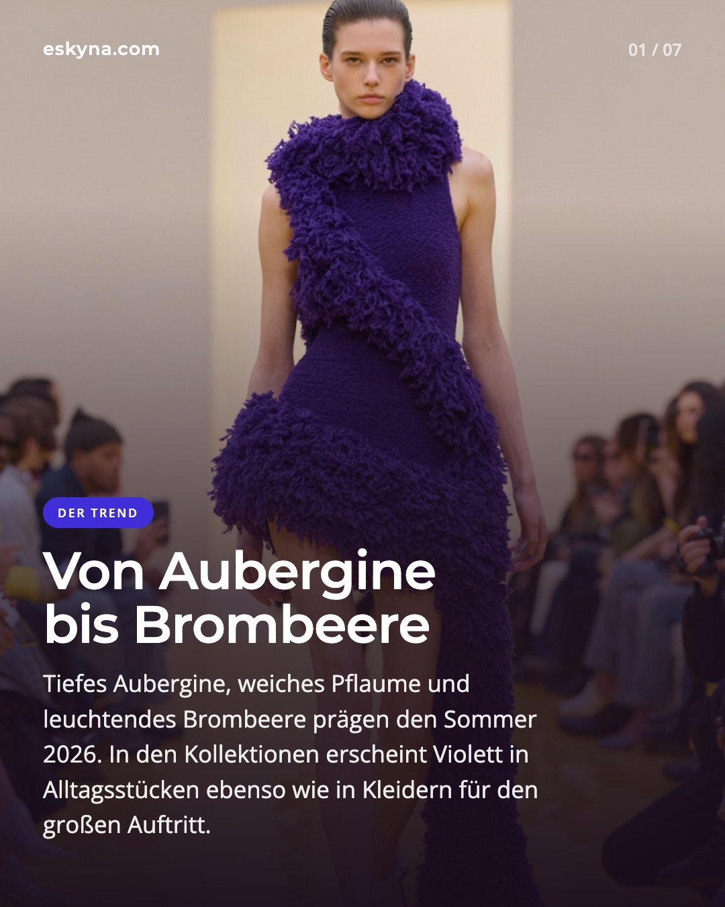
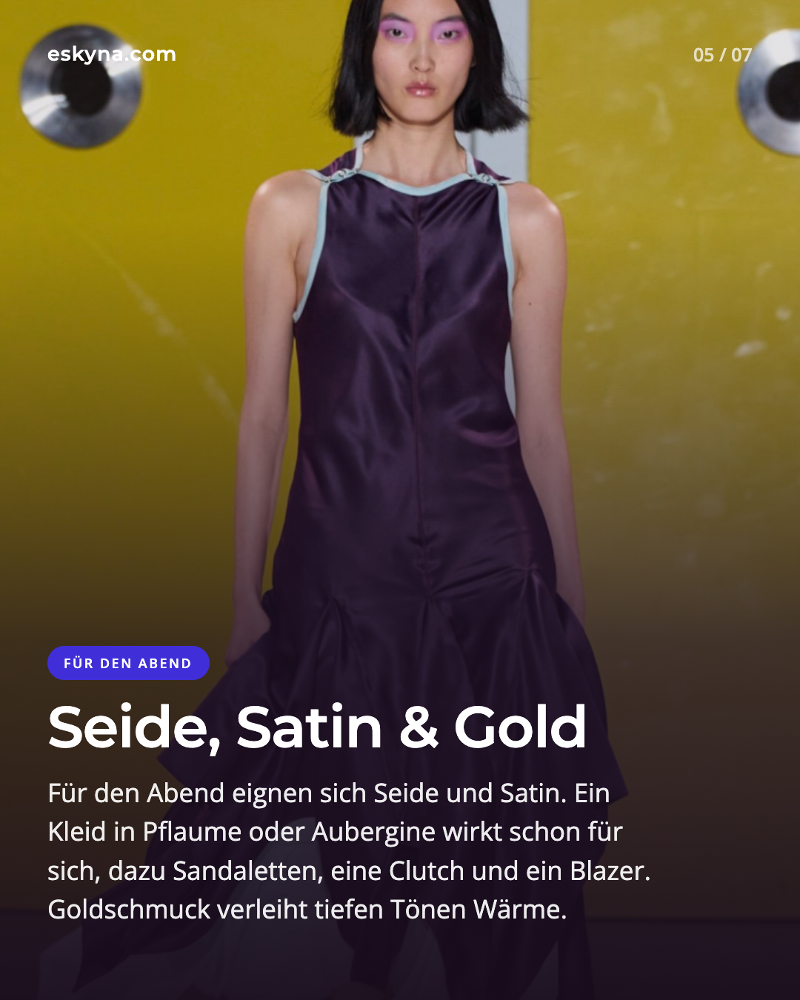
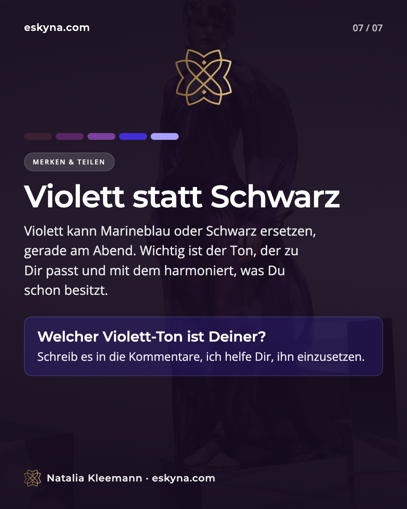

Violett ist zurück, nicht als zarter Nebenakzent, sondern als ganze Farbfamilie. Auf den Laufstegen für Frühjahr/Sommer 2026 taucht die Farbe in vielen Varianten auf: von tiefem Aubergine über Pflaume und Traube bis zu leuchtendem Brombeere, Amethyst und Flieder. Vogue spricht für die Saison von "Purple Reign" und beschreibt Violett als auffällige Rückkehr in Kleidern, Hosen und Accessoires.

Das Interessante an diesem Trend: Violett ist auffällig, aber nicht laut im klassischen Sinn. Es kann luxuriös, kreativ, geheimnisvoll, weich oder sehr klar wirken. Entscheidend sind Unterton, Material und Kombination.

## Warum Violett gerade jetzt so modern wirkt

Nach Jahren voller Beige, Grau, Schwarz, Navy und gedeckter Naturtöne bringt Violett wieder mehr Ausdruck in die Garderobe. Die Pantone-Farbberichte für Frühjahr/Sommer 2026 betonen Individualität, persönliche Handschrift und neue Farbkombinationen als zentrale Themen.

Auch London setzt laut Pantone auf eine Balance aus Alltagstauglichkeit, Emotion und subtiler Abweichung von Konventionen. Genau dort passt Violett perfekt: weniger erwartbar als Marineblau, weicher als Schwarz und erwachsener als ein sehr verspieltes Pink.

Dazu kommt modische Geschichte. Purpur war in der Antike so kostbar, dass die Farbe mit Macht, Reichtum und Herrschaft verbunden wurde. Später machte die Entdeckung von Mauvein im 19. Jahrhundert Violett deutlich zugänglicher und veränderte die Modewelt nachhaltig.

## Die wichtigsten Violett-Töne für Sommer 2026

Nicht jedes Violett wirkt gleich. Für den Alltag ist genau diese Unterscheidung entscheidend.

- Aubergine ist der tiefste und eleganteste Ton. Er funktioniert fast wie Schwarz oder Navy, wirkt aber weicher und interessanter.
- Pflaume hat oft eine leicht warme, rötliche Basis. Der Ton schmeichelt besonders, wenn dir warme Beerentöne, Camel oder Gold stehen.
- Brombeere und Heidelbeere gehen kühler und blauer. Diese Nuancen wirken klarer und moderner.
- Amethyst und Flieder sind heller und luftiger. Sie wirken im Sommer frisch, brauchen aber je nach Hautunterton Kontrast.

In den Pantone-Paletten für Frühjahr/Sommer 2026 tauchen unter anderem Burnished Lilac, Amaranth und Amethyst Orchid als relevante Lila- und Violett-Nuancen auf.

## Klein anfangen: Violett zu Weiß, Denim und Neutralen

Du brauchst keine komplett neue Garderobe. Der einfachste Einstieg ist ein einzelnes violettes Teil zu dem, was du schon besitzt.

Ein violettes Top zu weißer Hose. Eine pflaumenfarbene Bluse zu Jeans. Eine brombeerfarbene Tasche zu Creme, Sand oder Leinen. Ein violetter Schuh zu einem schlichten Kleid. Weiß und helle Neutraltöne nehmen tiefem Violett Schwere und machen die Farbe sommerlich.

Besonders schön ist Violett mit Denim und Hellblau. Der Blaustich beruhigt die Farbe, während Violett dem Look Tiefe gibt. Diese Kombination wirkt modern, aber nicht überstylt.

## Der Farbton muss zu dir passen

Violett ist eine Mischfarbe aus Rot und Blau. Genau deshalb kann sie warm oder kühl wirken.

Wenn du einen warmen Hautunterton hast, wirken Pflaume, Traube, Aubergine mit rötlicher Basis und warme Beerentöne meist harmonischer.

Wenn du einen kühlen Hautunterton hast, sind Brombeere, Heidelbeere, Amethyst, Lavendel und blaustichige Töne oft klarer.

Der beste Test ist einfach: Halte den Ton bei Tageslicht ans Gesicht. Macht er deine Haut ruhiger, deine Augen klarer und deine Konturen frischer, dann ist es dein Violett. Wirkt dein Gesicht müde, gelblich oder unruhig, trage den Ton besser weiter weg vom Gesicht, zum Beispiel als Rock, Hose, Schuh oder Tasche.

## Für den Abend: Seide, Satin und Gold

Violett liebt besondere Materialien. In Baumwolle wirkt die Farbe entspannt, in Strick weich, in Leinen sommerlich. In Seide, Satin, Organza oder Samt wird sie sofort abendtauglich.

Ein Kleid in Pflaume oder Aubergine ersetzt im Sommer das kleine Schwarze. Es wirkt elegant, aber weniger streng. Goldschmuck bringt Wärme hinein, besonders bei tiefen Beerentönen. Wer es kühler mag, kombiniert Brombeere oder Amethyst mit Silber, schwarzem Lackleder oder klaren weißen Akzenten.

## Für den Urlaub: Violett am Meer

Im Urlaub darf Violett leichter werden. Ein Badeanzug in Brombeere, ein Pareo in Flieder, eine Strandtasche in Aubergine oder eine Sonnenbrille mit violetter Fassung reichen völlig aus.

Besonders schön wirken dazu Weiß, Sand, Raffia, Bast, Muschel, Hellblau und ein wenig Gold. So bekommt Violett mediterrane Leichtigkeit.

## Mutiger kombinieren: Rot, Gelb, Grün

Wer Violett nicht nur als Akzent tragen möchte, kann 2026 mit stärkeren Farbkombinationen spielen.

Rot und Violett sind überraschend modern, weil beide Wärme und Tiefe erzeugen können. Gelb oder Limette wirken frischer und kontrastreicher. Grün, besonders Oliv, Salbei oder Smaragd, macht Violett erwachsener.

Wichtig ist, dass eine Farbe klar dominiert und die zweite als Akzent bleibt.

## Violett statt Schwarz

Der vielleicht beste Stylinggedanke für diesen Sommer: Violett kann dein neues Marineblau werden.

Dunkle Violetttöne funktionieren als Basisfarbe erstaunlich gut. Sie passen zu Weiß, Denim, Grau, Braun, Navy, Creme, Gold, Silber und Schwarz. Gleichzeitig bringen sie mehr Tiefe und Individualität in den Look.

Wenn dir Violett am Gesicht zu intensiv ist, trage es unten, als Rock, Hose, Sandale, Tasche oder Gürtel.

## Drei einfache Outfit-Formeln

1. Für den Alltag: weiße Jeans, violettes Top, flache Sandalen, Schmuck passend zum Unterton.
2. Fürs Büro: hellblaue Bluse, dunkelblaue oder graue Hose, auberginefarbener Gürtel oder Schuh.
3. Für den Abend: Satinkleid in Pflaume, schwarze oder goldene Sandaletten, kleine Clutch, schmaler Blazer.

## Häufige Fehler bei Violett

Der erste Fehler ist, den falschen Unterton direkt am Gesicht zu tragen.

Der zweite Fehler ist zu viel Dunkelheit im Sommer. Aubergine mit Schwarz kann elegant sein, mit Weiß, Haut, Sand, Gold oder Hellblau wirkt es deutlich leichter.

Der dritte Fehler ist zu viel Glanz gleichzeitig. Violett ist bereits eine starke Farbe. Ein glänzendes Element reicht oft aus.

## Fazit: Violett ist mehr als ein kurzer Effekt

Violett ist im Sommer 2026 mehr als ein Trendton. Die Farbe bringt Eleganz, Tiefe und Persönlichkeit in die Garderobe. Sie kann leise oder dramatisch sein, alltagstauglich oder festlich, kühl oder warm.

Entscheidend ist nicht, ob du Violett trägst, sondern welches Violett du trägst. Starte klein, teste die Farbe bei Tageslicht und kombiniere sie mit Teilen, die du bereits besitzt.

## Welcher Violett-Ton passt zu dir?

In einer persönlichen Stil- und Farbberatung findest du heraus, welche Nuancen deine Ausstrahlung stärken und wie du sie in alltagstaugliche Looks übersetzt.



## Quellen & weiterführende Lektüre

1. [Vogue: Spring 2026 Color Trends](https://www.vogue.com/article/spring-color-trends-2026)
2. [Pantone: New York Fashion Week Spring/Summer 2026](https://www.pantone.com/articles/fashion-color-trend-report/new-york-fashion-week-spring-summer-2026)
3. [Pantone: London Fashion Week Spring/Summer 2026](https://www.pantone.com/eu/en/articles/fashion-color-trend-report/london-fashion-week-spring-summer-2026)
4. [Pantone: Color of the Year 2026, Cloud Dancer](https://www.pantone.com/color-of-the-year/2026)
5. [ELLE: Trendfarbe Lila 2026](https://www.elle.de/fashion/modetrends-trendfarbe-lila-fruehjahr-2026)
6. [InStyle: Violett als Trendfarbe 2026](https://www.instyle.de/fashion/styling/trendfarbe-violett-kombinieren-fruehling-2026)
7. [Marie Claire: Red and Purple in Summer 2026](https://www.marieclaire.com/fashion/celebrity-style/summer-2026-red-purple-color-combination/)
8. [Smithsonian: A Purple Accident and Its Vibrant Impact](https://www.si.edu/stories/purple-accident-and-its-vibrant-impact)
9. [HISTORY: Why Purple Is the Color of Royalty](https://www.history.com/articles/why-is-purple-considered-the-color-of-royalty)
