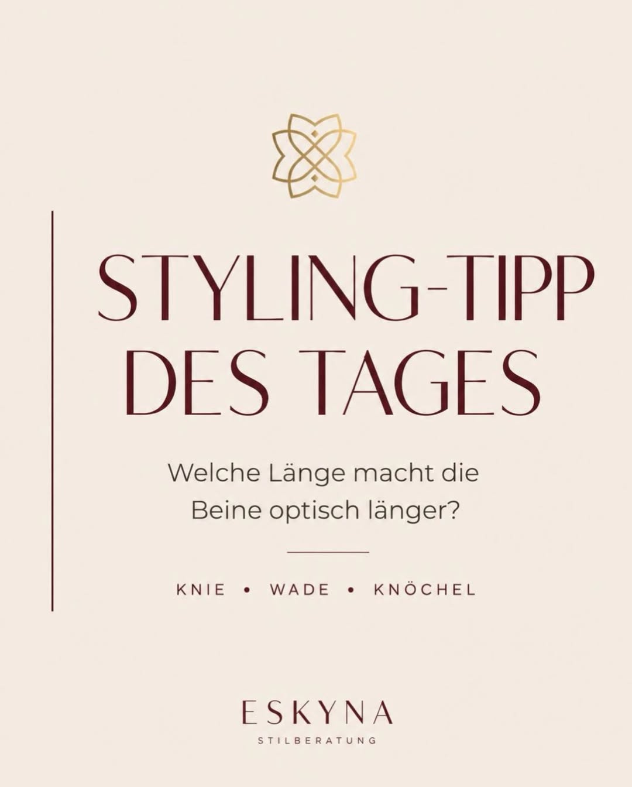
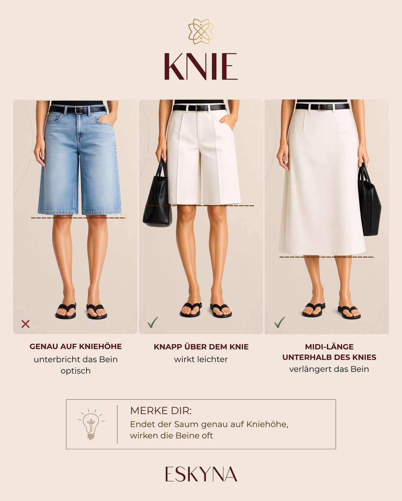
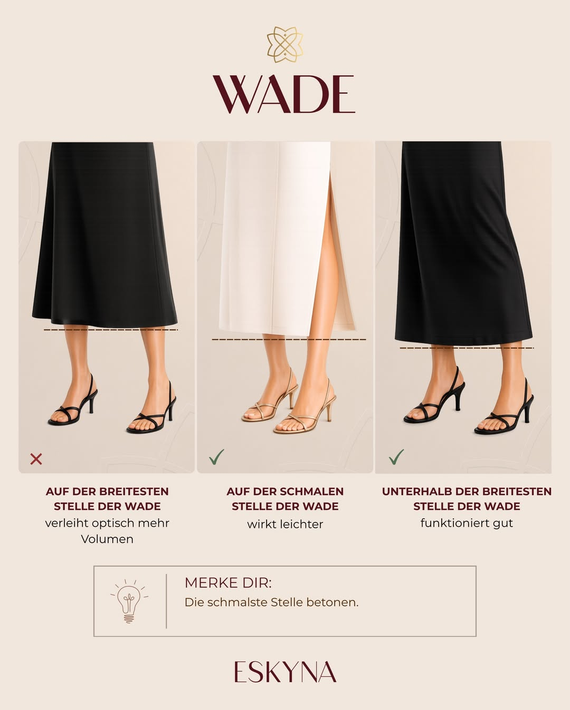

Die Länge deiner Kleidung hat nichts mit Stil zu tun.

Aber sie entscheidet sofort, wie ein Look wirkt.

Ein Rock kann hochwertig sein. Die Farbe kann passen. Der Schnitt kann grundsätzlich gut sein. Und trotzdem entsteht manchmal dieses Gefühl: Irgendetwas stimmt nicht.

- Die Beine wirken kürzer.
- Die Silhouette wirkt schwerer.
- Der Look verliert an Leichtigkeit.

Oft liegt es nicht an deiner Figur. Und auch nicht daran, dass dir Röcke nicht stehen. Sehr häufig liegt es an wenigen Zentimetern Saumlänge.

Genau deshalb lohnt es sich, Rocklängen bewusster zu betrachten. Denn unser Auge nimmt Proportionen nicht neutral wahr. Linien, Unterbrechungen und sichtbare schmale Stellen beeinflussen, ob ein Outfit gestreckt, harmonisch, leicht oder kompakt wirkt. Kleidung ist außerdem ein wichtiger Bestandteil der Personenwahrnehmung: Sie beeinflusst, wie ein Erscheinungsbild gelesen wird, ästhetisch, sozial und in seiner Wirkung.

## Inhalt

- Warum Rocklänge so viel verändert
- Knie: die schwierigste Saumhöhe
- Wade: der häufigste Sommerfehler
- Knöchel: kleine Stelle, große Wirkung
- So findest du deine ideale Rocklänge
- Fazit: Nicht die Figur ist das Problem, sondern oft die Linie

## Warum Rocklänge so viel verändert

Eine Rocklänge ist nie nur eine Länge. Sie setzt eine horizontale Linie auf deinem Körper.

Und genau diese Linie entscheidet, wohin der Blick gelenkt wird.

Endet ein Rock an einer sehr breiten oder optisch unruhigen Stelle, wird dieser Bereich betont. Endet er an einer schmaleren Stelle, wirkt der Look oft leichter und ruhiger. Das Prinzip ist einfach: Unser Auge sucht Orientierung. Es nimmt Linien, Unterbrechungen und Zusammenhänge als Gesamtbild wahr. Die Wahrnehmungsforschung beschreibt solche Prozesse als visuelle Organisation, wir sehen nicht nur einzelne Elemente, sondern ordnen sie zu Formen und Proportionen.

Für Mode bedeutet das:

Nicht jede Rocklänge wirkt an jeder Stelle gleich. Und manchmal entscheidet ein kleiner Unterschied darüber, ob ein Outfit stimmig aussieht oder nicht.

> **Merksatz:** Die beste Rocklänge ist selten die modischste. Sie ist die Länge, die deine Proportionen am ruhigsten und klarsten wirken lässt.

## Knie: die schwierigste Saumhöhe

Das Knie ist eine anspruchsvolle Stelle für Röcke und Kleider.

Endet ein Rock genau auf Kniehöhe, wird das Bein optisch unterbrochen. Der Blick bleibt an dieser Linie hängen. Das kann die Beine kürzer wirken lassen, selbst wenn der Rock eigentlich gut sitzt.

Besonders bei geraden Röcken, Bermudas oder Kleidern mit fester Saumkante passiert dieser Effekt schnell. Die Linie sitzt genau dort, wo das Bein ohnehin eine natürliche Unterbrechung hat. Dadurch wirkt der Look oft weniger fließend.

### Was beim Knie besser funktioniert

Ein Rock, der knapp oberhalb des Knies endet, wirkt meist leichter. Das Bein bleibt optisch freier, die Proportion öffnet sich und der Look bekommt mehr Dynamik.

Auch eine Midi-Länge knapp unterhalb des Knies kann sehr elegant aussehen. Wichtig ist, dass der Saum nicht exakt auf der Kniekante endet, sondern bewusst etwas darüber oder darunter liegt.

**Gut funktioniert häufig:**

- knapp über dem Knie
- knapp unter dem Knie
- Midi-Länge, wenn sie nicht an einer breiten Wadenstelle endet

**Vorsicht bei:**

- exakt auf Kniehöhe
- sehr geraden Säumen ohne Bewegung
- schweren Stoffen, die zusätzlich Volumen geben

> **Merke dir:** Wenn der Saum genau auf Kniehöhe endet, wirkt das Bein oft optisch unterbrochen. Ein paar Zentimeter darüber oder darunter können den gesamten Look verändern.

## Wade: der häufigste Sommerfehler

Bei der Wade passieren im Sommer die meisten Stylingfehler.

Das liegt daran, dass viele Kleider und Röcke genau an der breitesten Stelle der Wade enden. Diese Länge wirkt auf dem Bügel oft harmlos. Getragen kann sie den Look jedoch schwerer machen.

Warum? Weil der Saum dort eine horizontale Linie setzt, wo die Wade am kräftigsten ist. Der Blick wird genau auf diese Stelle gelenkt. Dadurch wirkt der Bereich optisch voller, auch wenn das gar nicht der tatsächlichen Körperform entspricht.

Das ist besonders bei Midikleidern wichtig. Viele Frauen denken, Midi sei automatisch elegant. Das stimmt grundsätzlich, aber nur, wenn die Länge gut platziert ist.

### Was bei der Wade besser funktioniert

Achte darauf, dass der Saum entweder an einer schmaleren Stelle der Wade endet oder etwas unterhalb der breitesten Stelle sitzt. Dadurch wirkt das Bein ruhiger und die Silhouette gestreckter.

Auch Schlitze, weich fallende Stoffe oder leicht ausgestellte Röcke können helfen, die Wadenpartie weniger kompakt wirken zu lassen.

**Gut funktioniert häufig:**

- Saum an der schmaleren Stelle der Wade
- Länge knapp unterhalb der breitesten Wadenstelle
- fließende Stoffe
- leichte A-Linie
- seitlicher oder vorderer Schlitz

**Vorsicht bei:**

- Saum exakt an der breitesten Stelle der Wade
- steifen Stoffen
- sehr geraden, schweren Midi-Röcken
- Schuhen mit breitem Riemen direkt am Knöchel, wenn der Look ohnehin schon horizontal unterbrochen ist

> **Merke dir:** Die Wade wirkt am harmonischsten, wenn der Saum nicht die breiteste Stelle betont, sondern eine schmalere oder ruhigere Linie findet.

## Knöchel: kleine Stelle, große Wirkung

Der Knöchel wird beim Styling oft unterschätzt.

Dabei ist er eine der wichtigsten Stellen, wenn ein Outfit leichter wirken soll. Sobald der Knöchel sichtbar bleibt, entsteht optisch Luft. Der Look wirkt moderner, beweglicher und weniger schwer.

Das ist auch der Grund, warum 7/8-Hosen bei vielen Frauen gut funktionieren. Sie zeigen einen schmalen Punkt des Beins und lassen dadurch selbst schlichte Outfits bewusster wirken.

Bei langen Röcken und Kleidern kann ein Schlitz eine ähnliche Wirkung haben. Er bringt Bewegung in den Look und verhindert, dass der Stoff wie eine geschlossene Fläche wirkt. Besonders bei Maxiröcken oder langen Sommerkleidern macht das einen großen Unterschied.

### Was am Knöchel besser funktioniert

Wenn du lange Röcke trägst, achte darauf, dass irgendwo Leichtigkeit entsteht: am Knöchel, durch einen Schlitz, durch fließenden Stoff oder durch Schuhe, die den Fuß nicht optisch abschneiden.

**Gut funktioniert häufig:**

- sichtbarer Knöchel
- 7/8-Länge
- Maxirock mit Schlitz
- fließender Stoff
- offene Schuhe oder feine Riemchen
- Schuhe mit niedrigerem Vamp, bei denen mehr Fuß sichtbar bleibt

**Vorsicht bei:**

- sehr langen, schweren Röcken ohne Bewegung
- Saum, der genau auf dem Schuh aufliegt
- geschlossenen Schuhen plus schwerem Stoff plus dunkler Farbe
- breiten Knöchelriemen, wenn der Look bereits stark unterbrochen ist

> **Merke dir:** Sichtbare Knöchel strecken nicht automatisch jedes Outfit, aber sie nehmen vielen Looks sofort die Schwere.

## So findest du deine ideale Rocklänge

Die beste Rocklänge findest du nicht nur mit einer Größentabelle. Du findest sie vor dem Spiegel.

Nimm dir einen Rock oder ein Kleid, bei dem du unsicher bist, und teste verschiedene Längen. Halte den Stoff einmal genau auf Kniehöhe, dann etwas darüber. Danach probiere eine Länge in der Wade und verschiebe den Saum ein paar Zentimeter nach oben oder unten.

Du wirst schnell sehen: Es geht nicht um große Veränderungen. Oft reichen zwei bis fünf Zentimeter.

Achte dabei auf drei Fragen:

1. **Wo bleibt der Blick hängen?**

Wenn dein Auge sofort auf den Saum fällt, kann die Länge unruhig wirken. 2. **Wirkt das Bein unterbrochen oder verlängert?**

Eine gute Länge führt den Blick weiter, statt ihn hart zu stoppen. 3. **Entsteht Leichtigkeit im Look?**

Besonders im Sommer darf ein Outfit atmen. Sichtbare schmale Stellen, Bewegung und fließende Linien helfen dabei.

Ein zusätzlicher Tipp: Fotografiere dich im Spiegel. Auf einem Foto erkennst du Proportionen oft klarer als in der Bewegung vor dem Spiegel.

## Der Schuh verändert die Rocklänge mit

Eine Rocklänge wirkt nie allein. Der Schuh entscheidet mit.

Ein Midirock kann mit einem feinen Slingback elegant und leicht aussehen. Mit einem sehr geschlossenen, schweren Schuh kann dieselbe Länge plötzlich kompakter wirken. Das bedeutet nicht, dass flache oder geschlossene Schuhe falsch sind. Es bedeutet nur: Rocklänge und Schuhform sollten zusammen gedacht werden.

Je mehr der Rock das Bein bedeckt, desto wichtiger wird die Frage, wie viel Fuß und Knöchel sichtbar bleibt.

**Als einfache Orientierung:**

- kurze Röcke vertragen oft mehr Schuhvolumen
- Midilängen brauchen eine ruhige, bewusste Schuhwahl
- lange Röcke wirken leichter mit sichtbarem Fuß, Schlitz oder Bewegung
- Knöchelriemen können schön sein, sollten aber nicht an einer ohnehin unterbrochenen Stelle zusätzlich kürzen

## Shopping-Check: Darauf solltest du achten

Vor deinem nächsten Shoppingtrip lohnt sich ein kurzer Blick auf die Saumlinie.

Frage dich nicht nur: "Gefällt mir der Rock?"

Frage dich auch: "Wo endet er an meinem Körper?"

Das macht den Unterschied zwischen einem Teil, das im Laden gut aussieht, und einem Teil, das du später wirklich gern trägst.

**Achte beim Anprobieren auf:**

- endet der Rock genau auf Kniehöhe?
- sitzt der Saum an der breitesten Stelle der Wade?
- bleibt der Knöchel sichtbar?
- wirkt der Stoff leicht oder schwer?
- passt die Länge zu den Schuhen, die du dazu tragen möchtest?
- kannst du dich gut bewegen?
- wirkt der Look von vorne und von der Seite harmonisch?

Wenn ein Rock fast gut ist, aber nicht ganz, kann eine Änderungsschneiderei die beste Investition sein. Manchmal wird aus einem schwierigen Kleidungsstück durch wenige Zentimeter ein Lieblingsteil.

## Fazit: Es liegt nicht an deiner Figur

Wenn ein Rock nicht stimmig wirkt, liegt das nicht automatisch an deinem Körper.

Sehr oft liegt es an der Linie.

Die richtige Rocklänge kann ein Outfit leichter, moderner und eleganter machen. Sie kann Beine optisch verlängern, Proportionen beruhigen und den gesamten Look hochwertiger wirken lassen.

Das ist kein Stylinggeheimnis. Es ist das Wissen darüber, wie unser Auge Proportionen wahrnimmt.

Wenn du das einmal verstanden hast, kaufst du bewusster ein. Du kombinierst schneller. Und du fühlst dich in deinen Looks sicherer.

> **Merksatz:** Nicht jede Länge muss dich optisch größer machen. Aber jede Länge sollte bewusst gewählt sein.

## Welche Rocklänge passt zu dir?

In einer persönlichen Stilberatung findest du heraus, welche Längen, Schnitte und Proportionen deine Wirkung am besten unterstützen. Nicht nach starren Regeln, sondern passend zu deiner Figur, deinem Alltag und deinem persönlichen Stil.

Denn ein guter Look beginnt nicht mit Trends.

Er beginnt mit Klarheit.

Der passende Instagram-Beitrag zum Artikel: [Rocklänge Styling-Tipp auf Instagram](https://www.instagram.com/p/DZ4pbmUCgX9/?img_index=1).



## Quellen & weiterführende Literatur

Für diesen Beitrag wurden Grundlagen aus Personenwahrnehmung und visueller Wahrnehmung berücksichtigt. Kleidung wird in der Forschung als Bestandteil der Personenwahrnehmung beschrieben. Visuelle Organisation erklärt, warum Linien, Unterbrechungen und Zusammenhänge unsere Wahrnehmung von Formen beeinflussen.

- Hester, N. und Hehman, E.: [Dress Is a Fundamental Component of Person Perception](https://pmc.ncbi.nlm.nih.gov/articles/PMC10559650/), Personality and Social Psychology Review.
