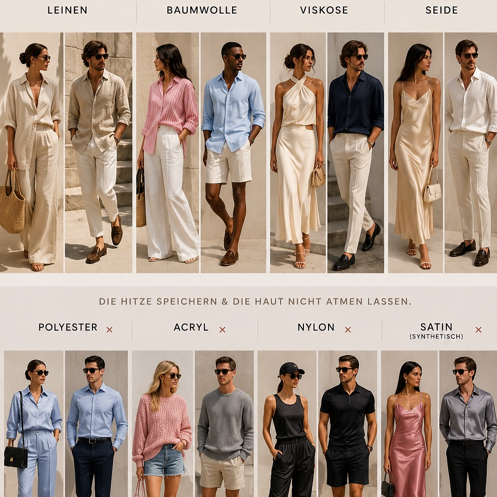
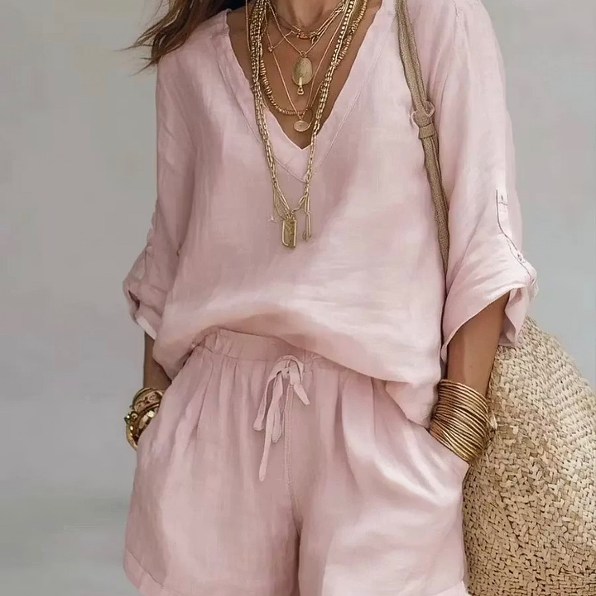
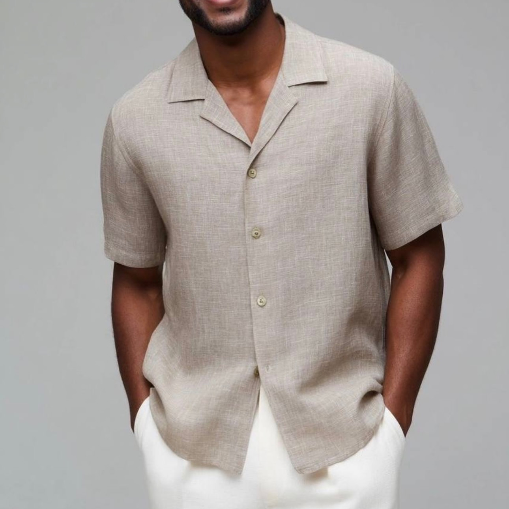

## Teaser

Es ist richtig heiß draußen.

Und genau jetzt entscheidet nicht nur die Farbe, sondern vor allem das Material.

Wenn Kleidung bei Hitze unangenehm wird, liegt das oft nicht am Schnitt allein. Häufig ist es der Stoff: Er klebt, staut Wärme oder lässt die Haut nicht richtig atmen. Die gute Nachricht: Mit den richtigen Sommerstoffen wirkt dein Outfit nicht nur leichter, sondern fühlt sich auch spürbar angenehmer an.

> **Merksatz:** Bei Hitze ist nicht weniger Kleidung die Lösung, sondern die richtige Kleidung.

_Leichte Stoffe, helle Farben und lockere Schnitte machen Sommerlooks angenehm und stilvoll zugleich._

## Inhalt

- Warum Stoff bei Hitze so viel ausmacht
- Die besten Sommerstoffe: Leinen, Baumwolle, Viskose und Seide
- Welche Materialien du bei Hitze besser bewusst auswählst
- Warum helle Farben angenehmer wirken
- Styling-Tipp: Locker sitzt besser
- Outfit-Ideen aus der Bildstrecke
- Fazit: Sommerstil beginnt beim Material

## Warum Stoff bei Hitze so viel ausmacht

An heißen Tagen geht es nicht nur darum, möglichst dünne Kleidung zu tragen. Entscheidend ist, wie ein Stoff mit Luft, Feuchtigkeit und Wärme umgeht.

Ein angenehmer Sommerstoff sollte drei Dinge können:

- Er sollte Luft an die Haut lassen.
- Er sollte Feuchtigkeit aufnehmen oder ableiten können.
- Er sollte nicht schwer, steif oder klebrig auf der Haut liegen.

Offizielle Empfehlungen zur Hitzeprävention nennen leichte, locker sitzende und atmungsaktive Kleidung sowie helle Farben als sinnvolle Wahl bei hohen Temperaturen. Genau deshalb fühlen sich manche Outfits an heißen Tagen sofort entspannter an, während andere schon nach wenigen Minuten unangenehm werden.

_Der Unterschied liegt im Material. Manche Stoffe lassen Luft und Feuchtigkeit besser zirkulieren, andere speichern Wärme schneller._

## Die besten Sommerstoffe für heiße Tage

### 1. Leinen: luftig, natürlich, elegant

Leinen ist einer der stärksten Sommerklassiker, und das aus gutem Grund. Der Stoff wird aus Flachsfasern gewonnen, ist von Natur aus eher fest im Griff und liegt dadurch oft nicht direkt eng auf der Haut. Genau dieser kleine Abstand hilft, dass Luft zirkulieren kann.

Leinen kann Feuchtigkeit aufnehmen und wirkt dadurch angenehm kühlend. Utah State University Extension beschreibt Flachsfasern als stark und verweist auf ihren kühlenden Effekt durch Feuchtigkeitsaufnahme.

Stilistisch wirkt Leinen besonders schön in:

- Hemdblusen
- weiten Hosen
- lockeren Sets
- Sommerkleidern
- Herrenhemden
- hellen Naturtönen wie Creme, Sand, Beige oder Offwhite

Leinen knittert. Genau das gehört zu seiner entspannten Eleganz. Im Sommer darf Kleidung leben.

_Monochrome Sommerlooks wirken besonders hochwertig, wenn Material, Farbe und Accessoires bewusst zusammenspielen._

### 2. Baumwolle: unkompliziert, hautfreundlich, vielseitig

Baumwolle ist ein Klassiker für den Alltag. Sie ist angenehm auf der Haut, robust und vielseitig kombinierbar. Besonders bei Sommerkleidung kommt es auf die Webart und Stoffstärke an.

Leichte Baumwollqualitäten wie Popeline, Voile, Batist, Musselin oder Seersucker fühlen sich deutlich luftiger an als schwere Baumwollstoffe wie Denim oder sehr dicker Jersey. Baumwolle ist bekannt für Feuchtigkeitsaufnahme, Atmungsaktivität und Tragekomfort.

Für heiße Tage eignen sich besonders:

- weiße Baumwollblusen
- Hemdblusenkleider
- luftige T-Shirts
- weite Baumwollhosen
- Baumwollröcke
- leichte Hemden

Styling-Tipp: Baumwolle wirkt schnell sehr casual. Mit Gürtel, Schmuck, Sonnenbrille oder einer hochwertigen Tasche bekommt der Look mehr Struktur.

_Eine leichte Bluse in Weiß wirkt frisch. Schwarze Accessoires geben dem Sommerlook sofort mehr Kontur._

### 3. Viskose: weich, fließend, elegant

Viskose ist besonders spannend, wenn du im Sommer weiche, fließende Silhouetten magst. Sie fällt schön, wirkt weniger steif als Baumwolle und fühlt sich oft kühl auf der Haut an.

Rayon beziehungsweise Viskose wird als feuchtigkeitsaufnehmend, atmungsaktiv und angenehm zu tragen beschrieben. Deshalb eignet sich Viskose sehr gut für Kleider, Blusen, weite Hosen oder sommerliche Sets.

Wichtig ist die Qualität: Sehr dünne Viskose kann schnell knittern oder empfindlich sein. Achte deshalb auf einen schönen Fall, gute Verarbeitung und Pflegehinweise.

Ideal für:

- Maxikleider
- weich fallende Blusen
- Palazzohosen
- Wickelkleider
- feminine Sommerlooks
- leichte Business-Outfits

### 4. Seide: edel, leicht, aber anspruchsvoll

Seide wirkt im Sommer luxuriös und leicht. Sie kann angenehm temperierend wirken und ist besonders schön bei eleganten Anlässen. Gleichzeitig ist Seide empfindlicher als Leinen oder Baumwolle. Schweiß, Deo und direkte Sonne können Spuren hinterlassen.

Deshalb eignet sich Seide besonders gut für Looks, die nicht den ganzen Tag in starker Hitze getragen werden müssen: Dinner, Event, Sommerabend, Hochzeit oder ein eleganter City-Look.

Bei Seide gilt: lieber locker, nicht zu eng, und möglichst in helleren oder gemusterten Varianten, wenn Schweißflecken ein Thema sein könnten. Silk wird als natürliche Protein-Faser mit luxuriösem Griff und hoher Wertigkeit beschrieben.

## Welche Materialien bei Hitze schwieriger sein können

Nicht jeder synthetische Stoff ist automatisch schlecht. Technische Sportmaterialien können gezielt dafür entwickelt sein, Feuchtigkeit abzuleiten. Im Alltag sieht es jedoch anders aus: Viele Kleidungsstücke aus Polyester, Acryl oder Nylon fühlen sich bei Hitze schneller warm, stickig oder klebrig an, vor allem, wenn sie eng sitzen oder dicht gewebt sind.

Besonders kritisch sind:

- Polyesterblusen ohne Luftigkeit
- Acrylstrick im Sommer
- enge Nylonkleidung
- synthetischer Satin
- schwere Mischgewebe ohne Atmungsaktivität

Ein wichtiger Hinweis: Satin ist keine Faser, sondern eine Webart. Ein Seidensatin kann sich ganz anders anfühlen als ein Polyester-Satin. Deshalb lohnt sich immer der Blick ins Pflegeetikett.

## Auch Farben machen einen Unterschied

Helle Farben reflektieren Sonnenlicht besser als dunkle und fühlen sich bei direkter Sonne oft angenehmer an. Cal/OSHA empfiehlt bei Hitze unter anderem helle Kleidung, weil sie Wärme besser reflektiert als dunkle Kleidung.

Für sommerliche Looks eignen sich besonders:

- Weiß
- Creme
- Ecru
- Sand
- Beige
- Hellblau
- Rosé
- Salbei
- helle Pastelltöne

Das bedeutet nicht, dass Schwarz im Sommer verboten ist. Wenn du schnell überhitzt, können helle Töne in Kombination mit luftigen Stoffen aber einen spürbaren Unterschied machen.

_Helle Farben, A-Linie und Abstand zur Haut. Ein einfacher Sommerlook kann genau deshalb so angenehm wirken._

## Styling-Tipp: Locker sitzt besser

Bei Hitze braucht Kleidung Raum. Enge Schnitte lassen weniger Luft an die Haut und können Feuchtigkeit schneller stauen. Locker sitzende Kleidung unterstützt die Luftzirkulation und wirkt dadurch oft angenehmer.

Das heißt nicht, dass alles oversized sein muss. Es geht um bewusst gesetzte Weite:

- eine weite Hose mit schmalerem Top
- eine lockere Bluse mit klarer Taille
- ein Hemd offen über einem Top
- ein A-Linien-Kleid statt eines engen Etuikleids
- ein luftiges Herrenhemd statt eines eng anliegenden Shirts

So bleibt der Look stilvoll, ohne dass er streng oder überladen wirkt.

_Sommerliche Eleganz für Herren. Ein helles Leinenhemd wirkt entspannt, gepflegt und hitzetauglich._

## Outfit-Ideen aus der Bildstrecke

### Look 1: Rosa Leinen-Set mit Naturaccessoires

Das rosafarbene Set wirkt weich, sommerlich und feminin, ohne verspielt zu sein. Durch den lockeren Schnitt entsteht Luftigkeit, während Goldschmuck und Basttasche dem Look Wärme und Struktur geben.

**Styling-Formel:**

Leichter Stoff + Ton-in-Ton-Farbe + natürliche Accessoires = entspannte Sommer-Eleganz.

### Look 2: Weiße Bluse mit Punktmuster

Die gepunktete Bluse zeigt, wie sommerliche Kleidung auch city-tauglich funktioniert. Weiß bringt Frische, das Muster macht den Look lebendig, und schwarze Accessoires geben Kontur.

**Styling-Formel:**

Helle Basis + grafisches Muster + klare Accessoires = moderner Sommer-Chic.

### Look 3: Weißes A-Linien-Kleid

Das weiße Kleid wirkt minimalistisch, aber nicht langweilig. Die lockere Form lässt Luft an die Haut und schafft Bewegung. Mit Sonnenbrille und kleiner Tasche entsteht ein Look, der unkompliziert und trotzdem gepflegt aussieht.

**Styling-Formel:**

Klare Farbe + luftige Silhouette + reduzierte Accessoires = mühelose Sommerwirkung.

### Look 4: Helles Herrenhemd mit weißer Hose

Der Herrenlook zeigt, dass Sommerstil nicht kompliziert sein muss. Ein helles, strukturiertes Hemd wirkt gepflegter als ein T-Shirt, bleibt aber durch den lockeren Schnitt entspannt.

**Styling-Formel:**

Leinenhemd + helle Hose + lockerer Sitz = sommerlich, ruhig, souverän.

## Kurze Checkliste für heiße Tage

Bevor du morgens dein Outfit auswählst, stelle dir diese Fragen:

1. Ist der Stoff leicht und atmungsaktiv?
2. Liegt das Kleidungsstück locker genug auf der Haut?
3. Ist die Farbe eher hell oder reflektierend?
4. Kann Luft zirkulieren?
5. Fühlt sich der Stoff auch nach mehreren Stunden noch angenehm an?
6. Passt der Look zu deinem Alltag, nicht nur zum Wetter?

Wenn du mehrere Fragen mit Ja beantworten kannst, ist dein Outfit wahrscheinlich eine gute Wahl für heiße Tage.

## Fazit: Sommerstil beginnt beim Material

Bei Hitze geht es nicht darum, möglichst wenig Kleidung zu tragen. Es geht darum, bewusster zu wählen.

Leinen, Baumwolle, Viskose und leichte Seide können Sommerlooks angenehmer machen, weil sie Luftigkeit, Feuchtigkeitsaufnahme und Komfort unterstützen. Helle Farben reflektieren Sonnenlicht besser, und lockere Schnitte geben der Haut Raum zum Atmen.

Ein guter Sommerlook fühlt sich nicht nur schön an. Er lässt dich freier bewegen, ruhiger auftreten und besser durch heiße Tage kommen.

**Die wichtigste Styling-Regel für Hitze:**

Nicht weniger Kleidung. Sondern die richtige Kleidung.

## Möchtest du wissen, welche Sommerstoffe wirklich zu dir passen?

In einer persönlichen Stil- und Farbberatung findest du heraus, welche Materialien, Farben und Schnitte deine Ausstrahlung unterstützen und welche Sommerlooks zu deinem Alltag, deinem Körpergefühl und deinem Stil passen.

Der passende Instagram-Beitrag zum Artikel: [Sommerstoffe auf Instagram](https://www.instagram.com/p/DaF9IvWCnMK/?img_index=1).



## Quellen & weiterführende Literatur

- Cal/OSHA: Empfehlungen zu leichter, lockerer, atmungsaktiver und heller Kleidung bei Hitze. [Quelle](https://www.dir.ca.gov/dosh/etools/08-006/EWP_workClothing.htm)
- Utah State University Extension: Hinweise zu Stoffwahl bei Sommerhitze, unter anderem Leinen und Rayon/Viskose. [Quelle](https://extension.usu.edu/news_sections/home_family_and_food/summer-hydration.pdf)
- Utah State University Extension: Flachs/Leinen und kühlender Effekt durch Feuchtigkeitsaufnahme. [Quelle](https://extension.usu.edu/archive/the-facts-on-flax)
- Fibre2Fashion: Eigenschaften von Baumwolle, unter anderem Feuchtigkeitsaufnahme und Atmungsaktivität. [Quelle](https://www.fibre2fashion.com/market-intelligence/texpro-textile-and-apparel/textile-guide/10501/cotton-fabric)
- Ohio State University Fact Sheet, archiviert: Eigenschaften von Rayon/Viskose. [Quelle](https://www.apparelsearch.com/education/ohio_state_clothing_education/rayon_multi-faceted_fiber.htm)
- Fibre2Fashion: Eigenschaften und Einordnung von Seide. [Quelle](https://www.fibre2fashion.com/market-intelligence/texpro-textile-and-apparel/textile-guide/10502/silk-fabric)
