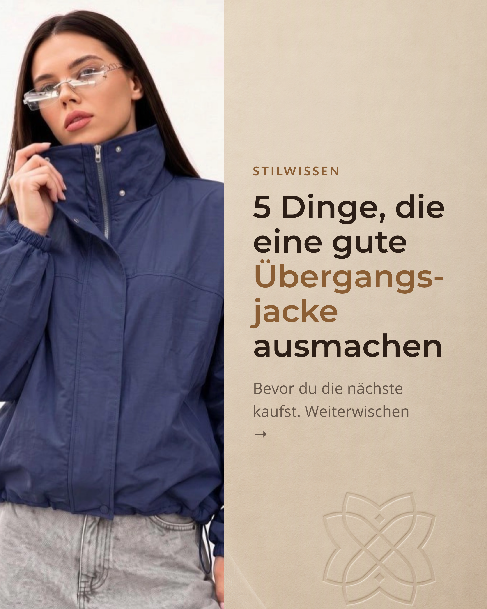
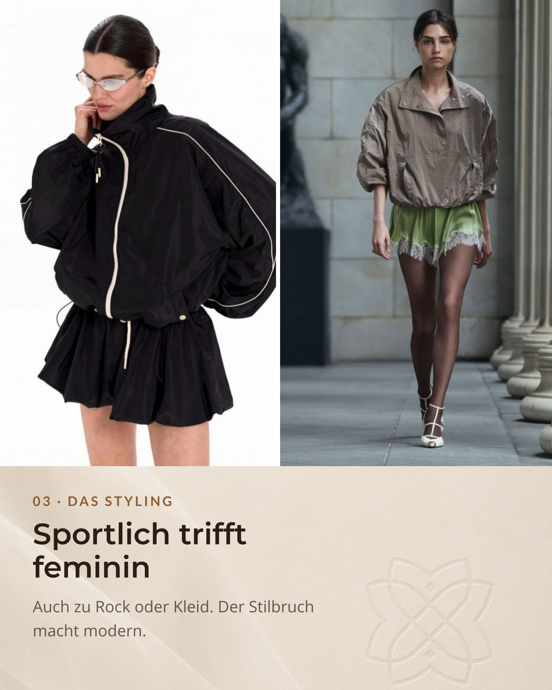
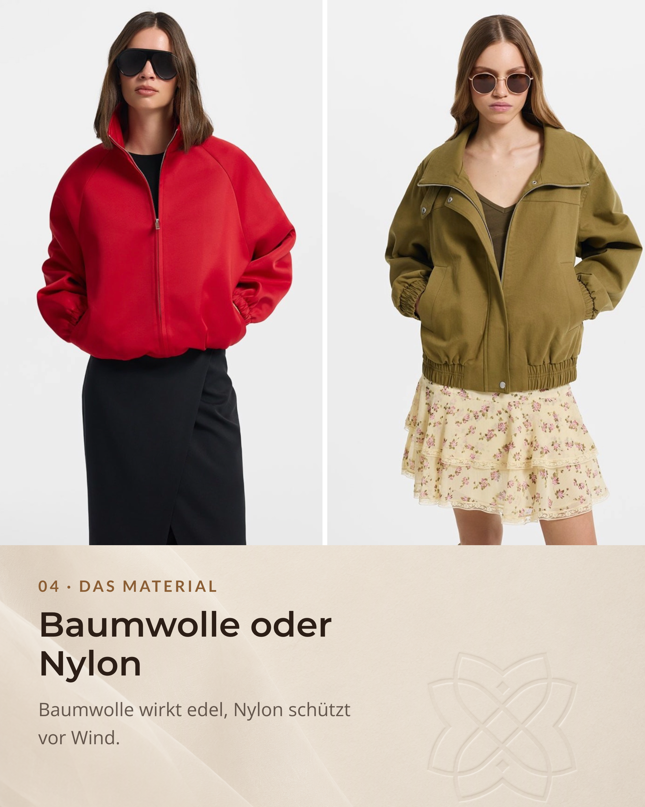

Der Wechsel der Jahreszeiten bringt jedes Jahr dieselbe modische Challenge: Das Wetter ist unberechenbar. Morgens frisch, mittags warm, abends wieder kühl.

Genau hier kommt die Übergangsjacke ins Spiel.

Wenn du tiefer in das Thema einsteigen willst, findest du im Glossar ergänzende Begriffe wie [Layering](/glossar/layering/), [Anorak](/glossar/anorak/) und [Parka](/glossar/parka/).

Doch was macht ein wirklich gutes Modell aus, das nicht nur funktional ist, sondern auch deinen Stil unterstreicht? Hier findest du die wichtigsten Punkte für deinen nächsten Kauf.

## 01. Die Passform: Genug Raum für den Zwiebellook

Für den Alltag sind Modelle mit geradem oder lockerem Schnitt meist die beste Wahl. Der praktische Grund heißt Layering oder Zwiebelprinzip.

Fakt ist: Zwei bis drei dünne Schichten wärmen oft besser als eine dicke Schicht. Die Luft zwischen den Lagen wirkt wie eine zusätzliche Isolation. Unter eine locker sitzende Jacke passen T-Shirt, Hemd und an kühlen Tagen sogar ein leichter Grobstrick-Pullover oder Cardigan, ohne dass du Bewegungsfreiheit verlierst.

Styling-Tipp: Kurze, kastig geschnittene Jacken harmonieren besonders gut mit High-Waist-Hosen oder Röcken. Teste in der Kabine aktiv mit. Hebe die Arme und achte darauf, dass die Jacke nicht ständig hochrutscht.

## 02. Der Kragen: Klarer Schutz, klare Linie

Der Hals- und Nackenbereich ist in der Übergangszeit besonders empfindlich bei Wind. Ein Stehkragen oder hoher Kragen erfüllt zwei Aufgaben: Er schützt zuverlässig und gibt der Jacke eine klare, strukturierte Silhouette.

Achte beim Kauf darauf, dass der Kragen auch geschlossen nicht am Kinn drückt oder kratzt. Gleichzeitig sollte er offen getragen locker fallen und sich harmonisch in dein Outfit einfügen.

## 03. Das Styling: Sportlich trifft feminin

Anoraks, Parkas und Oversize-Windbreaker wirken auf den ersten Blick sportlich. Genau hier entsteht Potenzial für starke Looks.

Kombiniere funktionale Jacken bewusst mit fließenden Satinröcken, Slip-Dresses oder eleganten Stoffhosen wie Culottes. Bei mildem Wetter wirken dazu Loafer, spitze Ballerinas oder schlichte Sandalen modern und leicht.

Dieser Kontrast aus robuster Outerwear und femininen Teilen schafft Spannung. Dein Look wirkt aktueller und individueller.

## 04. Das Material: Funktion zuerst

Die Materialwahl entscheidet über Look und Alltagstauglichkeit.

- Baumwolle oder Twill: Wirken natürlich und hochwertig. Atmungsaktiv und vielseitig. Reine Baumwolle trocknet langsamer und ist bei Regen weniger ideal.
- Nylon und technische Gewebe: Sehr leicht, windabweisend und oft gut bei wechselhaftem Wetter.
- Softshell und Mischgewebe: Für aktive Tage sinnvoll, weil sie atmungsaktiv sind und Feuchtigkeit nach außen transportieren.

Prüfe zusätzlich das Etikett und die Verarbeitung. Sind die Nähte sauber? Fühlt sich das Material wertig an? Knittert es sofort oder bleibt die Form stabil?

Mehr zu Stoffwirkung und Fall findest du auch im Glossar unter [Materialfall](/glossar/materialfall/).

## 05. Vor dem Kauf: Der schnelle Praxis-Check

Bevor du dich entscheidest, mach einen kurzen Realitäts-Check. Eine gute Jacke muss im echten Alltag funktionieren.

- Offen und geschlossen anprobieren: Wirkt die Jacke in beiden Varianten stimmig?
- Arme heben und Ärmellänge prüfen: Zieht es am Rücken oder werden die Handgelenke frei?
- Reißverschluss und Kapuze testen: Lässt sich alles flüssig bedienen und sitzt die Kapuze sinnvoll?
- Taschen prüfen: Sind sie tief genug für Handy, Schlüssel und kalte Hände?

## Die ehrlichste Frage zum Schluss

Wozu wirst du diese Jacke in den nächsten zwei Monaten tragen?

Das beste Modell passt nahtlos in deine bestehende Garderobe. Es sollte zu deinen letzten Spätsommer-Looks und zu den ersten herbstlichen Outfits funktionieren.

Wenn du deine Teile langfristig klug kombinieren willst, lohnt sich ein Blick auf [Capsule Wardrobe](/glossar/capsule-wardrobe/).

## Welche Übergangsjacke passt zu dir?

In einer persönlichen Stilberatung klären wir, welche Übergangsjacken wirklich zu deiner Figur, deinem Farbtyp und deiner Persönlichkeit passen. So trägst du funktionale Looks nicht zufällig, sondern bewusst.



Passend zum Beitrag findest du den Instagram-Post hier: [Übergangsjacke Guide auf Instagram](https://www.instagram.com/p/DbII7pBClVP/?img_index=1).

## Quellen und modische Referenzen

- [Grazia Magazin](https://www.grazia-magazin.de/): Styling-Ideen für Layering bei Übergangswetter und den Mix aus sportlichen Jacken und femininen Elementen.
- [Peek and Cloppenburg](https://www.peek-cloppenburg.de/de/): Grundlagen zu Passform und Layering mit mehreren dünnen Schichten.
- [Bergfreunde Magazin](https://www.bergfreunde.de/blog/): Materialeigenschaften zu Baumwolle, Nylon und Mischgeweben bei wechselhaftem Wetter.
