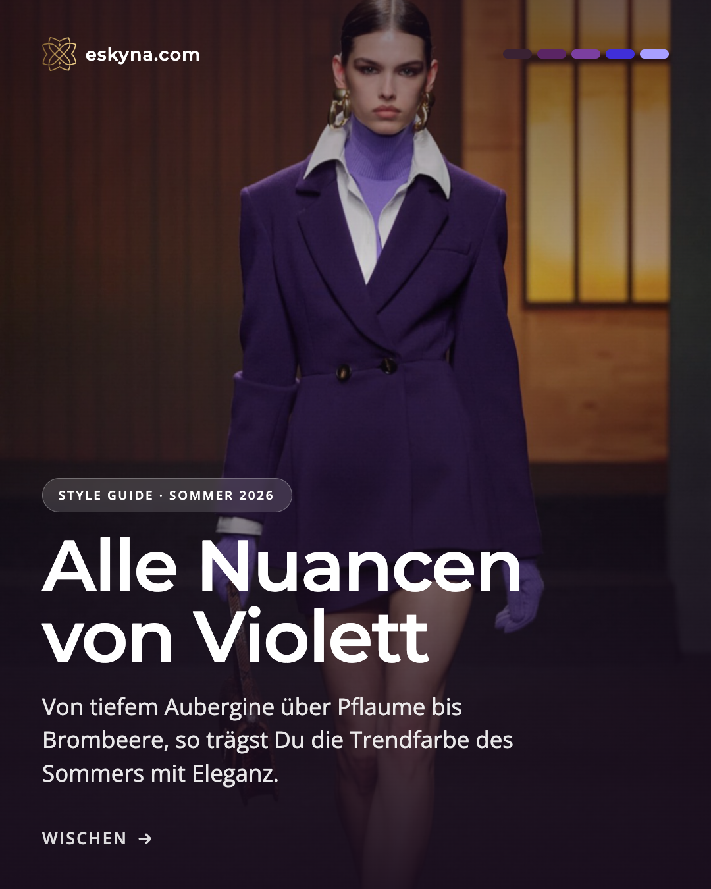
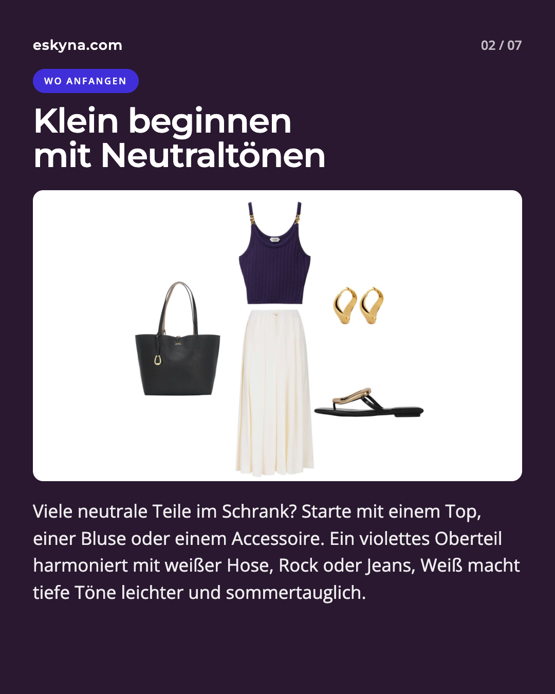
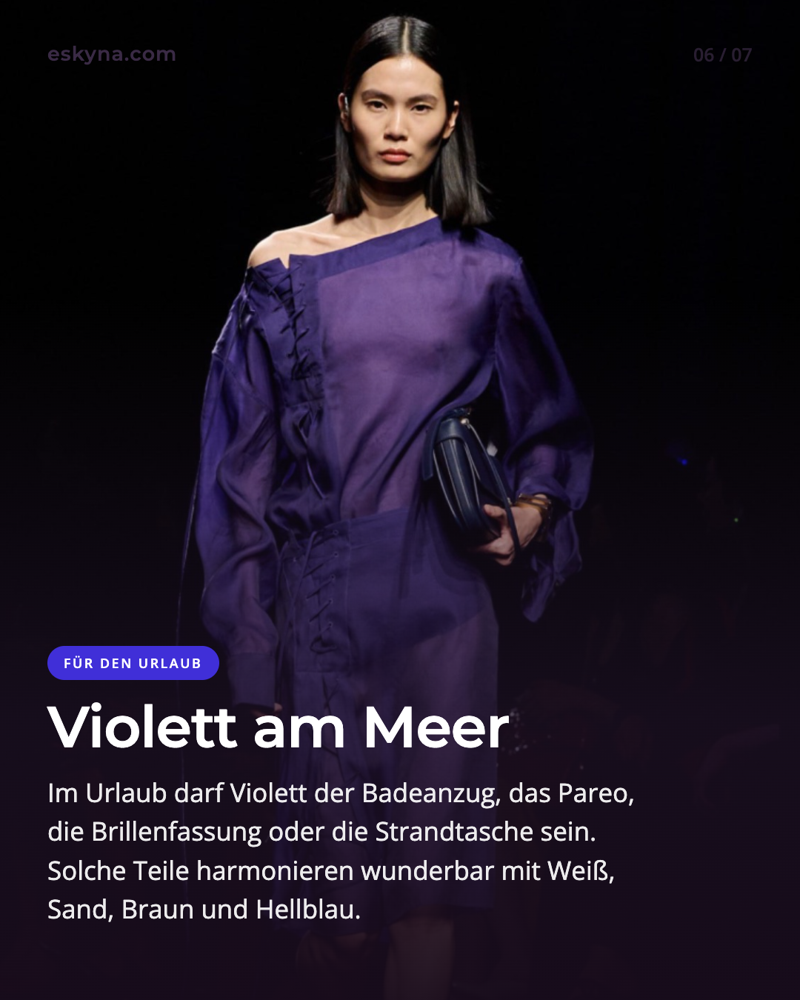

Purple is back, not as a small accent, but as a full color family. On the Spring/Summer 2026 runways, we see everything from deep eggplant and plum to bright blackberry tones, amethyst, and lilac. Vogue even described the season as a "Purple Reign" moment.

What makes this trend interesting is its range. Purple can look luxurious, creative, mysterious, soft, or sharp, depending on undertone, fabric, and styling.

## Why purple feels modern right now

After years dominated by beige, gray, black, navy, and muted naturals, purple adds personality again. Pantone's Spring/Summer 2026 reports emphasize individual expression and new color pairings.

Purple sits exactly in that space. It is less expected than navy, softer than black, and often more grown-up than bright pink.

Purple also carries fashion history. Tyrian purple was once linked to status and power because it was extremely expensive to produce. Later, the discovery of mauveine in the 19th century made purple far more accessible and changed fashion permanently.

## The key purple shades for summer 2026

Not every purple looks the same in real life. This distinction matters most.

- Eggplant is the deepest and most elegant option. It works almost like black or navy, but feels softer.
- Plum often has a warmer, red-based direction and can be very flattering with warm palettes.
- Blackberry and blueberry tones are cooler and clearer, with a modern edge.
- Amethyst and lilac are lighter and airier, perfect for summer when balanced with enough contrast.

Pantone's seasonal palettes include shades like Burnished Lilac, Amaranth, and Amethyst Orchid, all relevant for this direction.

## Start small: purple with white, denim, and neutrals

You do not need a full new wardrobe. One purple piece is often enough.

Try a purple top with white trousers. A plum blouse with jeans. A blackberry bag with cream and linen. A purple sandal with a simple dress. White and light neutrals make deep purple feel lighter and more summery.

Purple also works beautifully with denim and light blue. The blue undertone calms the color while purple adds depth.

## The right shade must fit your undertone

Purple is a mix of red and blue, so it can lean warm or cool.

If your undertone is warm, plum, grape, red-based eggplant, and warmer berry shades often look harmonious.

If your undertone is cool, blackberry, blueberry, amethyst, lavender, and blue-based purples are usually clearer and fresher.

A simple test helps: hold the color near your face in daylight. If your skin looks calmer and your features clearer, it is likely your shade. If your face looks tired or uneven, wear that purple farther away from your face, for example as a skirt, trousers, shoes, or bag.

## For evening: silk, satin, and gold

Purple loves elevated fabrics. In cotton it feels relaxed. In knit it feels soft. In silk or satin it becomes evening-ready quickly.

A plum or eggplant dress can replace the little black dress in summer and feel less severe. Gold jewelry adds warmth to deep berry shades. If you prefer a cooler look, pair blackberry or amethyst with silver, black patent details, or clean white accents.

## For vacation: purple by the sea

On vacation, purple can feel lighter: a blackberry swimsuit, a lilac pareo, an eggplant beach bag, or purple-framed sunglasses.

White, sand, raffia, shell tones, light blue, and touches of gold create a Mediterranean feeling without making the look heavy.

## Bolder combinations: red, yellow, green

If you want more than accents, summer 2026 invites stronger pairings.

Red and purple can look surprisingly modern. Yellow or lime add fresh contrast. Green, especially olive, sage, or emerald, makes purple feel more mature.

A good rule: let one color dominate and keep the second color as an accent.

## Purple instead of black

A practical styling idea this season: purple can work as your new dark neutral.

Deep purple shades pair well with white, denim, gray, brown, navy, cream, gold, silver, and black while adding more individuality than classic black.

If purple near your face feels too strong, wear it on the lower half or as accessories.

## Three easy outfit formulas

1. Everyday: white jeans, purple top, flat sandals, jewelry chosen by undertone.
2. Office: light blue blouse, navy or gray trousers, eggplant belt or shoes.
3. Evening: plum satin dress, black or gold sandals, small clutch, slim blazer.

## Common mistakes with purple

The first mistake is wearing the wrong undertone close to the face.

The second is too much darkness in summer. Eggplant with black can look elegant, but also heavy. Add white, skin tones, sand, gold, or light blue for balance.

The third is too much shine at once. Purple is already expressive, so one glossy element is often enough.

## Final thought

Purple in summer 2026 is more than a short-lived trend. It can be subtle or dramatic, casual or formal, cool or warm.

The key is not whether you wear purple, but which purple you choose. Start small, test shades in daylight, and combine them with pieces you already own.

## Which purple shade suits you best?

In a personal style and color consultation, you can identify the shades that support your natural coloring and translate them into wearable outfits for your real life.



## Sources and further reading

1. [Vogue: Spring 2026 Color Trends](https://www.vogue.com/article/spring-color-trends-2026)
2. [Pantone: New York Fashion Week Spring/Summer 2026](https://www.pantone.com/articles/fashion-color-trend-report/new-york-fashion-week-spring-summer-2026)
3. [Pantone: London Fashion Week Spring/Summer 2026](https://www.pantone.com/eu/en/articles/fashion-color-trend-report/london-fashion-week-spring-summer-2026)
4. [Pantone: Color of the Year 2026, Cloud Dancer](https://www.pantone.com/color-of-the-year/2026)
5. [ELLE: Purple Trend 2026](https://www.elle.de/fashion/modetrends-trendfarbe-lila-fruehjahr-2026)
6. [InStyle: How to Style Purple in 2026](https://www.instyle.de/fashion/styling/trendfarbe-violett-kombinieren-fruehling-2026)
7. [Marie Claire: Red and Purple in Summer 2026](https://www.marieclaire.com/fashion/celebrity-style/summer-2026-red-purple-color-combination/)
8. [Smithsonian: A Purple Accident and Its Vibrant Impact](https://www.si.edu/stories/purple-accident-and-its-vibrant-impact)
9. [HISTORY: Why Purple Is the Color of Royalty](https://www.history.com/articles/why-is-purple-considered-the-color-of-royalty)
