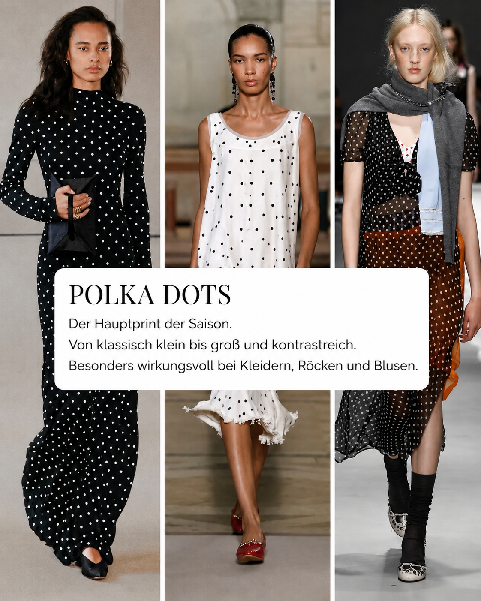
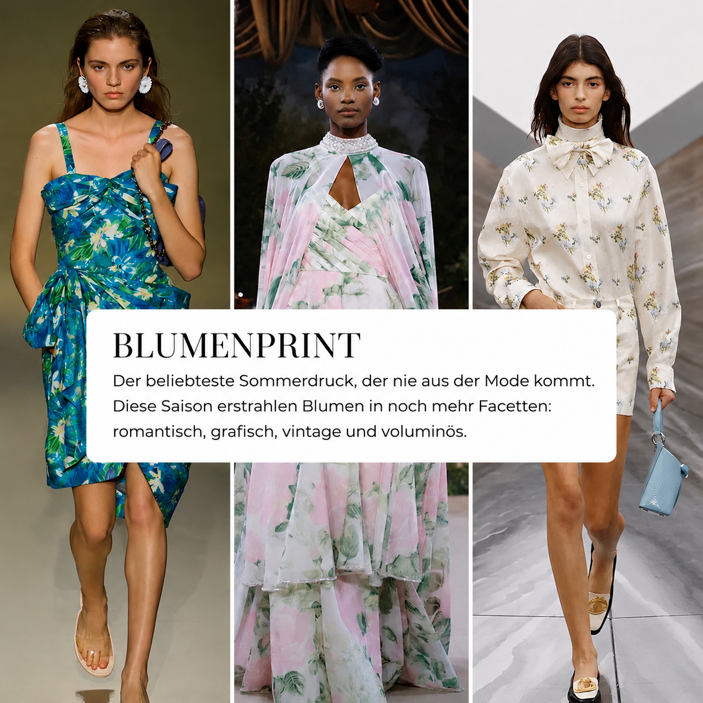
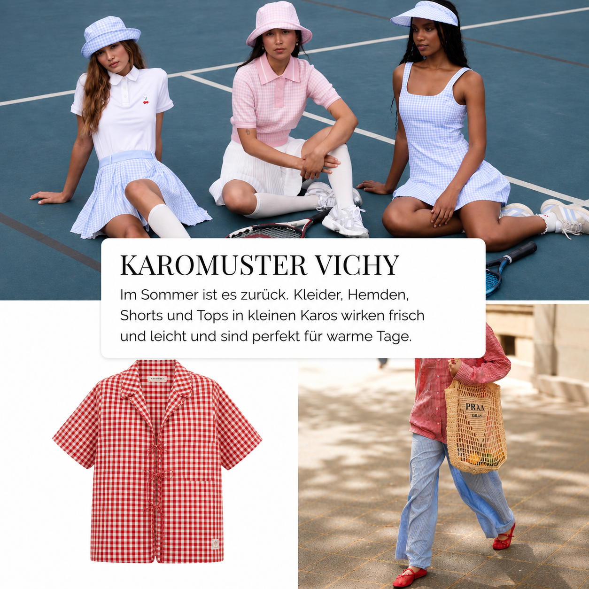

Patterns make outfits feel alive. They add rhythm, contrast, movement, and personality.

In summer 2026, [polka dots](/en/glossar/polka-dots/), [gingham](/en/glossar/vichy-karo/), [stripes](/en/glossar/streifen/), [floral prints](/en/glossar/blumenmuster/), and [animal prints](/en/glossar/animal-print/) are especially visible again. But the important question is not only: **What is trending?** The better question is: **Does this pattern support my personality, my proportions, and the impression I want to create?**

## Why patterns change the impact of an outfit

A pattern is never just decoration. It guides the eye across the body and changes how calm, dynamic, playful, or confident an outfit feels.

Large patterns usually create more presence. Small patterns often feel quieter. Strong light-dark contrast attracts the eye quickly, while tonal patterns blend more softly into the look. Direction matters too: stripes guide the eye, florals can feel romantic or graphic, animal prints add tension, and dots can look classic, charming, or very modern.

> **ESKYNA note:** A good pattern should not disguise you. It should strengthen your presence.

## 1. Polka dots: the graphic classic

Polka dots are classic, but not old-fashioned. They can look playful, elegant, minimal, or bold, depending on size, contrast, and styling.

Small dots are usually subtle and refined. Large dots become a statement. [Black](/en/glossar/schwarz/) and [white](/en/glossar/weiss/) is the classic version, while [cream](/en/glossar/creme/), [brown](/en/glossar/braun/), [navy](/en/glossar/navy/), and warm neutrals feel softer and more modern.

**Works well:**

- a polka-dot blouse with plain trousers
- a dotted midi skirt with a simple top
- a dress with small dots and a clear waist
- dots in black-white, navy-white, or warm natural tones
- large dots as a deliberate statement piece

**Be careful with:**

- too many playful details at once
- dots plus ruffles plus bows if you want a more grown-up look
- strong contrast exactly where you do not want attention

## 2. Floral prints: the summer classic

Florals return almost every summer, but their effect changes with scale, color, and cut.

Small delicate florals often look softer and more romantic. Large florals feel more confident. Florals on a light background look fresh and summery, while florals on a dark background appear more elegant or dramatic.

If you love florals but do not want to look overly romantic, choose clearer garment shapes: a shirt dress, a straight skirt, or a clean blouse. Accessories should stay calm so the print can work without looking busy.

## 3. Gingham: fresh and easy

Gingham feels light, summery, and uncomplicated. It brings a picnic-like freshness, but can look modern when combined with clean basics.

A gingham top with [white](/en/glossar/weiss/) trousers, a checked shirt with [denim](/en/glossar/denim/), or a gingham dress with minimal sandals works especially well. To keep gingham from becoming too sweet, avoid too many bows, ruffles, and retro details at the same time.

## 4. Stripes: direction and clarity

Stripes are one of the most useful patterns because they immediately create direction. Vertical stripes can lengthen the silhouette, horizontal stripes can add calm width, and diagonal stripes bring movement.

The more contrast a stripe has, the more visible it becomes. Fine tonal stripes are easier to integrate into business and everyday outfits. Bold stripes work well when the rest of the look stays simple.

## 5. Animal print: tension as an accent

Animal prints add energy. They can feel glamorous, edgy, classic, or playful depending on color and scale.

For many wardrobes, [animal print](/en/glossar/animal-print/) works best as an accent: shoes, belt, scarf, bag, or one clear garment. If the print covers a large area, keep silhouette and accessories calm.

## How to choose a pattern that suits you

Before buying a trend pattern, ask five questions:

- Does the scale of the pattern suit my proportions?
- Does the contrast support my color direction?
- Does the pattern match my style personality?
- Can I combine it with at least three pieces I already own?
- Does it help me create the impact I want?

A trend is only useful when it becomes wearable for your life. The best pattern is not the loudest one. It is the one that makes your outfit feel more intentional.
