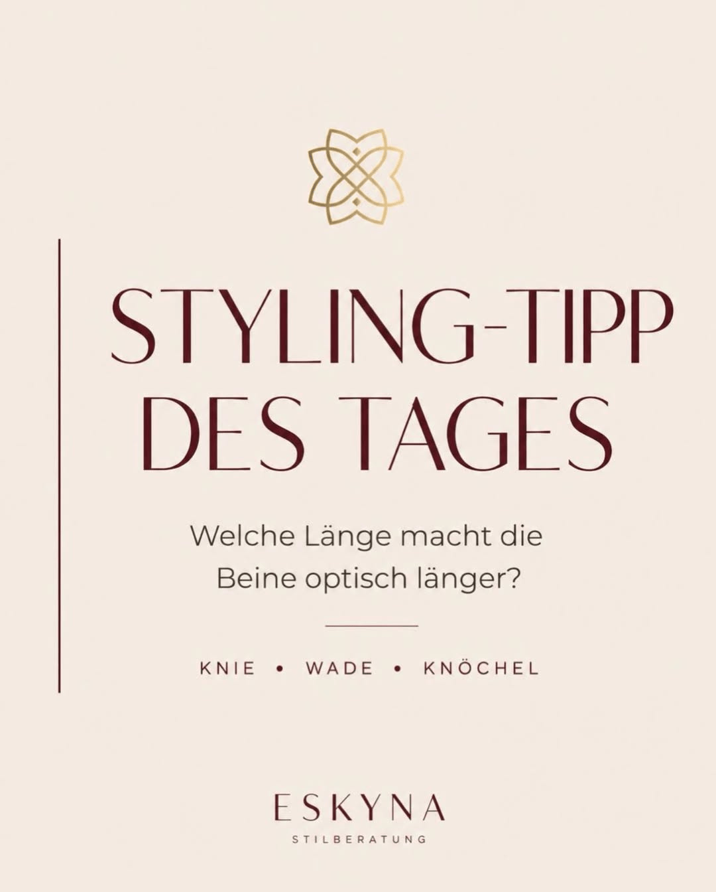

The length of a skirt or dress changes the whole impression of an outfit.

A skirt can have a beautiful color, good fabric, and a generally flattering cut. Still, something may feel slightly off: the legs look shorter, the silhouette feels heavier, or the outfit loses lightness.

Very often, the reason is only a few centimeters of hem length.

## Why skirt length matters so much

Our eye does not read proportions neutrally. It reacts to lines, interruptions, narrow points, and the relationship between hem and shoe.

A hem that ends at a visually broad point can make the leg look shorter or heavier. A hem that ends at a narrower point can create more lightness. This does not mean that one length is always right and another is always wrong. It means that length has an effect.

## Knee length: often the most difficult point

Knee length can be elegant, but it is also demanding. If the hem ends exactly at the widest or most angular part of the knee, the leg line can look interrupted.

A skirt that ends slightly above or slightly below the knee often feels more intentional. The exact point depends on your proportions, the cut of the skirt, and the shoe.

## Calf length: the classic midi challenge

Midi skirts are beautiful, but many people struggle with them. If the hem ends at the widest part of the calf, the leg can look shorter.

Try moving the hem slightly higher or lower. A midi skirt often becomes more flattering when it ends below the widest calf point and leaves a narrower ankle visible.

## Ankle length: elegant when the shoe works

Long skirts and dresses can look very elegant. The key is the connection to the shoe. If the fabric is heavy and the shoe is visually bulky, the look can feel grounded. If the shoe shows a clean line, the outfit often feels lighter.

Pointed shoes, delicate sandals, slingbacks, or clean sneakers can all work, depending on the style direction.

## The shoe-hem relationship

Skirt length never works alone. Always look at the shoe:

- A pointed toe can visually lengthen the leg.
- A heavy ankle strap can interrupt the line.
- A nude or low-contrast shoe can create more continuity.
- A strong contrast shoe can be stylish, but it becomes a deliberate focal point.

## ESKYNA styling test

Stand in front of a mirror and take three photos: one with the hem slightly higher, one at the current length, and one slightly lower. Compare the overall silhouette, not only the skirt.

Ask yourself:

- Where does the eye stop?
- Does the outfit feel light or heavy?
- Does the length support my shoes?
- Does the proportion fit the occasion and my style?

The best skirt length is the one that creates balance between your body, the garment, and the whole look.
