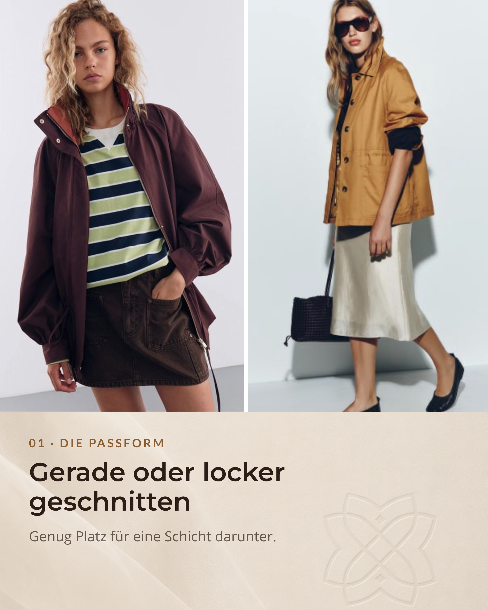
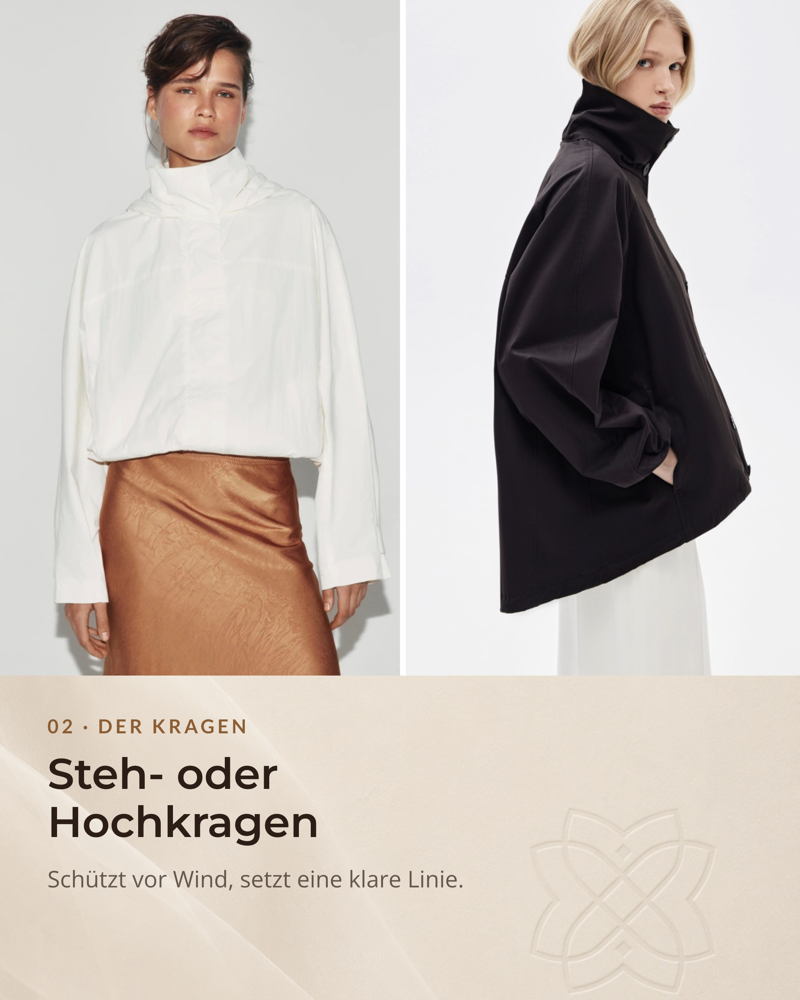

Season changes always bring the same fashion challenge: the weather is unpredictable. Cool in the morning, warm at noon, windy again in the evening.

That is exactly where a transitional jacket becomes essential.

But what makes a model truly good, not only functional, but also aligned with your personal style? Here are the key points to focus on before your next purchase.

## 01. Fit: Enough room for layering

For daily life, straight or relaxed cuts are usually the best choice. The practical reason is simple: layering.

Fact: Two or three lighter layers often keep you warmer than one heavy layer. Air between layers acts as additional insulation. Under a relaxed jacket, you can wear a T-shirt, shirt, and on cooler days even a light chunky knit or cardigan without losing freedom of movement.

Styling tip: Short, boxy jackets pair especially well with high-waist trousers or skirts. In the fitting room, test movement actively. Raise your arms and check whether the jacket rides up too much.

## 02. Collar: Clear protection, clear line

In-between seasons, the neck area is especially sensitive to wind. A stand collar or high collar serves two functions: better protection and a sharper, more structured silhouette.

When trying on, make sure the collar does not press against your chin when fully closed. At the same time, it should fall naturally when worn open.

## 03. Styling: Sporty meets feminine

Anoraks, parkas, and oversized windbreakers often look sporty at first glance. That is exactly what makes them so useful for modern contrast styling.

Try pairing a functional jacket with a flowing satin skirt, a slip dress, or elegant culottes. In mild weather, loafers, pointed ballet flats, or minimal sandals can make the outfit feel lighter and more refined.

This mix of robust outerwear and softer pieces creates visual tension and gives your look a more current edge.

## 04. Material: Function comes first

Material choice shapes both the look and day-to-day performance.

- Cotton or twill: Natural and polished, breathable, and versatile. Pure cotton tends to hold moisture longer and is less ideal for rainy days.
- Nylon and technical fabrics: Lightweight, often wind-resistant, and strong for changeable weather.
- Softshell and blended fabrics: Great for active days, especially when breathability and moisture transport matter.

Also inspect finish quality. Are the seams clean? Does the fabric feel substantial? Does it crease immediately or keep its structure?

## 05. Before buying: A quick real-life check

Before deciding, do a short practical check. A good jacket has to work in real life, not only on a hanger.

- Try it open and closed: Does the silhouette work in both versions?
- Raise your arms and check sleeve length: Does the back pull? Do your wrists become too exposed?
- Test zipper and hood: Do they work smoothly and sit correctly?
- Test every pocket: Is there enough space for your phone, keys, and cold hands?

## The most honest final question

What will you realistically wear this jacket for in the next two months?

The best model fits seamlessly into your current wardrobe. It should work with your late-summer outfits and your first cozy fall combinations.

## ESKYNA STYLE COACHING

Not sure which transitional jacket really matches your figure, lifestyle, and style direction?

Together, we find the pieces that make you look radiant and make daily styling easier.

[Request your consultation at ESKYNA.COM](https://eskyna.com)

Related Instagram post: [Transitional Jacket Guide on Instagram](https://www.instagram.com/p/DbII7pBClVP/?img_index=1).

## Sources and style references

- [Grazia Magazine](https://www.grazia-magazin.de/): Layering ideas for in-between temperatures and styling sporty jackets with feminine pieces.
- [Peek and Cloppenburg](https://www.peek-cloppenburg.de/de/): Guidance on fit and layering with multiple light layers.
- [Bergfreunde Magazine](https://www.bergfreunde.de/blog/): Material properties of cotton, nylon, and fabric blends in changeable weather.
