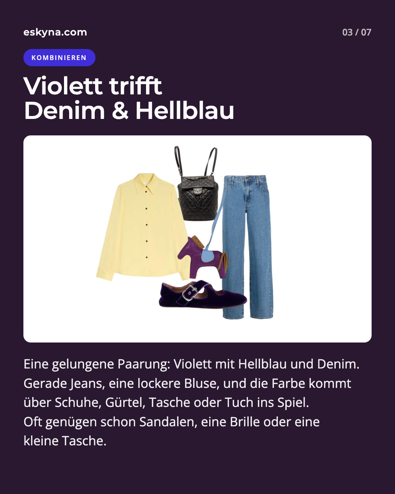
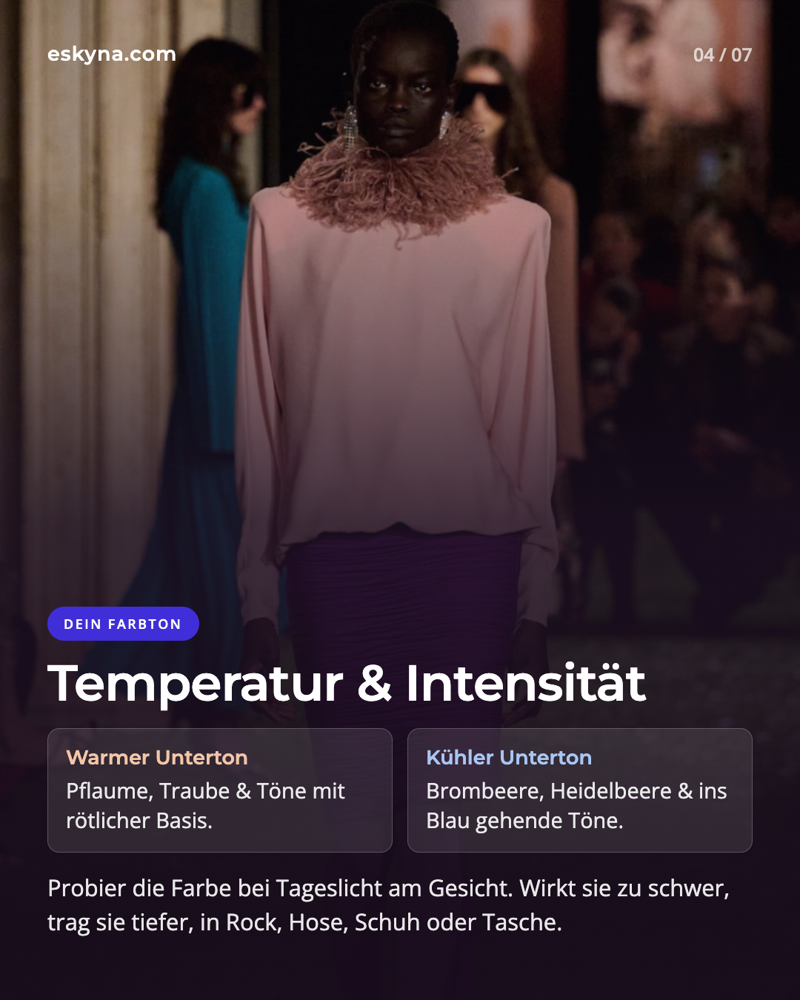

[Фиолетовый](/ru/glossar/violett/) снова вернулся, и не как небольшой акцент, а как целое семейство оттенков. На подиумах сезона весна-лето 2026 цвет появился во множестве вариантов: от глубокого [баклажанового](/ru/glossar/aubergine/) и сливового до ярких ягодных оттенков, аметиста и [лилового](/ru/glossar/flieder/). Vogue даже описывает этот сезон как "Purple Reign".

Главная сила этого тренда в гибкости. Фиолетовый может выглядеть роскошно, креативно, мягко, загадочно или графично. Все зависит от подтона, материала и комбинации.

## Почему фиолетовый сейчас особенно актуален

После лет, когда в гардеробе доминировали бежевый, серый, черный, [navy](/ru/glossar/navy/) и приглушенные натуральные оттенки, фиолетовый возвращает выразительность. В отчетах Pantone для весны-лета 2026 акцент сделан на индивидуальность, личный стиль и новые цветовые сочетания.

Фиолетовый отлично вписывается в эту идею. Он менее ожидаем, чем темно-синий, мягче черного и часто выглядит взрослее, чем ярко-[розовый](/ru/glossar/pink/).

У цвета есть и историческая глубина. Тирский пурпур в древности был очень дорогим и ассоциировался со статусом и властью. Позже открытие mauveine в XIX веке сделало фиолетовые красители значительно доступнее и изменило моду.

## Главные оттенки фиолетового на лето 2026

Не каждый фиолетовый работает одинаково. Для носибельности это принципиально.

- Баклажановый, самый глубокий и элегантный, часто работает как альтернатива черному и navy.
- Сливовый обычно теплее и более красноватый.
- Ежевичный и черничный оттенки прохладнее, чище и более современны.
- Аметист и лиловый светлее и воздушнее, особенно хороши летом при правильном контрасте.

В палитрах Pantone также выделяются Burnished Lilac, Amaranth и Amethyst Orchid как актуальные [лила](/ru/glossar/lila/) и фиолетовые направления.

## Начните с малого: фиолетовый с белым, денимом и нейтральными

Для старта не нужен полностью новый гардероб. Часто достаточно одной вещи.

Фиолетовый топ с белыми брюками. Сливовая блуза с джинсами. Ежевичная сумка с кремовым и льном. Фиолетовые сандалии с простым платьем. Светлые нейтрали делают глубокий фиолетовый более летним.

Также особенно удачно фиолетовый сочетается с [денимом](/ru/glossar/denim/) и [светло-голубым](/ru/glossar/hellblau/). Голубой подтон делает образ спокойнее, а фиолетовый добавляет глубину.

## Оттенок должен подходить именно вам

Фиолетовый состоит из красной и синей составляющей, поэтому он может быть теплым или холодным.

Если у вас теплый подтон кожи, обычно гармоничнее смотрятся сливовый, виноградный, теплый баклажановый и теплые ягодные оттенки.

Если у вас холодный подтон, чаще лучше работают ежевичный, черничный, аметистовый, лавандовый и более синеватые фиолетовые тона.

Простой тест: приложите оттенок к лицу при дневном свете. Если кожа выглядит ровнее, а черты лица четче, оттенок вам подходит. Если лицо кажется уставшим или тусклым, носите этот цвет дальше от лица, например в юбке, брюках, обуви или сумке.

## Для вечера: шелк, [сатин](/ru/glossar/satin/) и золото

Фиолетовый особенно раскрывается в выразительных фактурах. В хлопке он выглядит расслабленно, в трикотаже мягко, а в шелке или сатине сразу становится вечерним.

Платье сливового или баклажанового оттенка легко заменяет маленькое черное летом и выглядит мягче. Золотые украшения добавляют тепла глубоким ягодным тонам. Для более холодного настроения сочетайте ежевичный или аметистовый с серебром, черным лаком или чистыми белыми акцентами.

## Для отпуска: фиолетовый у моря

В отпуске фиолетовый может быть легче: купальник ежевичного оттенка, лиловый парео, баклажановая пляжная сумка или очки в фиолетовой оправе.

С белым, песочным, рафией, светло-голубым и небольшими золотыми акцентами получается легкое средиземноморское настроение.

## Смелые сочетания: красный, желтый, зеленый

Если вы хотите не только акцент, лето 2026 позволяет более контрастные пары.

Красный с фиолетовым может выглядеть очень современно. Желтый или лайм дают свежий контраст. Зеленый, особенно оливковый, шалфейный или изумрудный, делает фиолетовый более зрелым.

Важно, чтобы один цвет доминировал, а второй оставался акцентом.

## Фиолетовый вместо черного

Практичная идея сезона: фиолетовый может стать вашей новой темной базой.

Глубокие фиолетовые оттенки хорошо сочетаются с белым, денимом, серым, коричневым, navy, кремовым, золотом, серебром и черным, при этом выглядят более индивидуально.

Если у лица цвет кажется слишком интенсивным, носите его ниже или в аксессуарах.

## Три простые формулы образов

1. На каждый день: белые джинсы, фиолетовый топ, сандалии и украшения по подтону.
2. Для офиса: светло-голубая блуза, темно-синие или серые брюки, баклажановый ремень или обувь.
3. Для вечера: сливовое сатиновое платье, черные или золотые сандалии, маленький клатч, лаконичный блейзер.

## Частые ошибки

Первая ошибка, неподходящий подтон у лица.

Вторая, слишком много темного летом. Баклажановый с черным может выглядеть элегантно, но тяжело. Белый, песочный, золотой и светло-голубой сразу добавляют легкости.

Третья, избыток блеска одновременно. Фиолетовый уже сам по себе выразителен, обычно достаточно одного блестящего элемента.

## Итог

Летом 2026 фиолетовый, это не краткий эффект, а полноценная цветовая база. Он может быть спокойным или драматичным, повседневным или вечерним, теплым или холодным.

Ключевой вопрос не в том, носить ли фиолетовый, а в том, какой именно фиолетовый работает для вас. Начните с малого, тестируйте оттенки при дневном свете и сочетайте их с тем, что уже есть в вашем гардеробе.

## Какой оттенок фиолетового ваш?

На персональной консультации по стилю и цвету вы сможете определить оттенки, которые усиливают вашу внешность, и собрать носибельные сочетания для реальной жизни.



## Источники и дополнительное чтение

1. [Vogue: Spring 2026 Color Trends](https://www.vogue.com/article/spring-color-trends-2026)
2. [Pantone: New York Fashion Week Spring/Summer 2026](https://www.pantone.com/articles/fashion-color-trend-report/new-york-fashion-week-spring-summer-2026)
3. [Pantone: London Fashion Week Spring/Summer 2026](https://www.pantone.com/eu/en/articles/fashion-color-trend-report/london-fashion-week-spring-summer-2026)
4. [Pantone: Color of the Year 2026, Cloud Dancer](https://www.pantone.com/color-of-the-year/2026)
5. [ELLE: Trendfarbe Lila 2026](https://www.elle.de/fashion/modetrends-trendfarbe-lila-fruehjahr-2026)
6. [InStyle: Violett als Trendfarbe 2026](https://www.instyle.de/fashion/styling/trendfarbe-violett-kombinieren-fruehling-2026)
7. [Marie Claire: Red and Purple in Summer 2026](https://www.marieclaire.com/fashion/celebrity-style/summer-2026-red-purple-color-combination/)
8. [Smithsonian: A Purple Accident and Its Vibrant Impact](https://www.si.edu/stories/purple-accident-and-its-vibrant-impact)
9. [HISTORY: Why Purple Is the Color of Royalty](https://www.history.com/articles/why-is-purple-considered-the-color-of-royalty)
