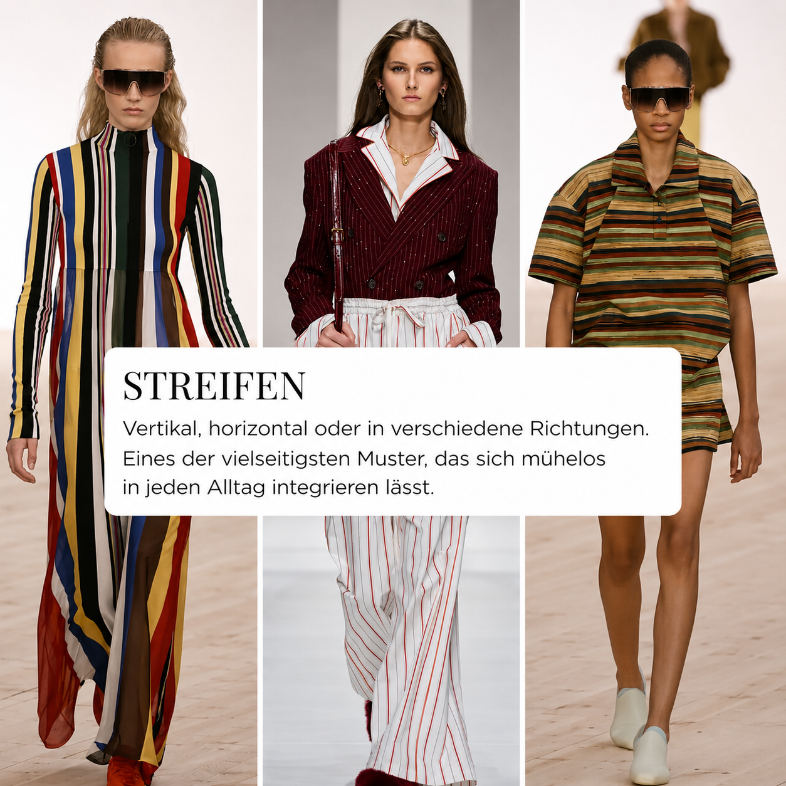
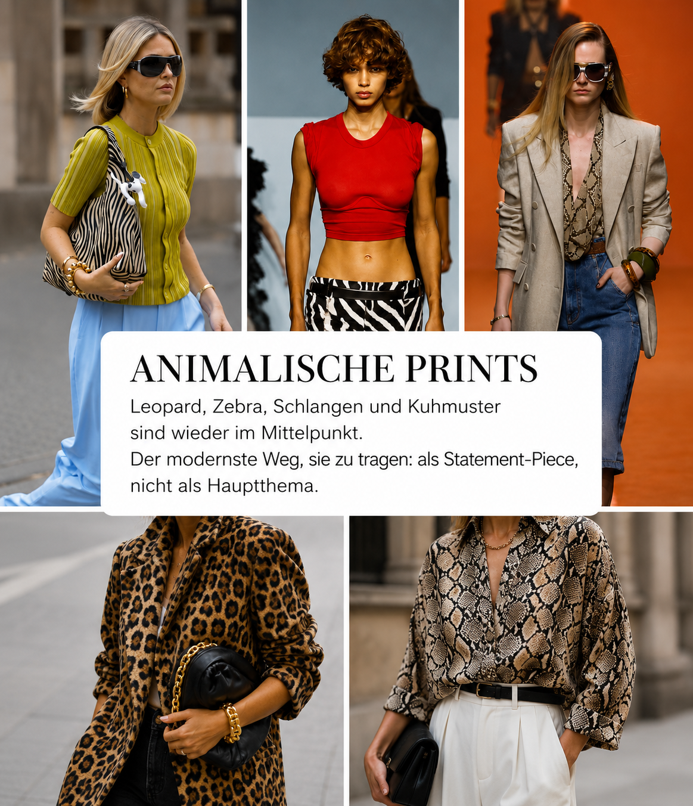

Узоры делают образы живыми. Они задают ритм, контраст и воздействие.

Летом 2026 горошек, клетка виши, полоски, цветочные узоры и анималистичные принты снова в центре внимания. Но не каждый тренд подходит вам.

Важнее другой вопрос: **Поддерживает ли этот узор мою личность и мою индивидуальность?**

## Почему узоры меняют образ наряда

Узор никогда не просто украшение. Он задает ритм, контраст и движение на вашем теле.

Большие узоры выглядят более присутствующими. Маленькие узоры часто выглядят спокойнее. Сильные контрасты света и тени привлекают взгляд быстрее. Мягкие, тональные узоры легче интегрируются в образ.

Также роль играет направление. Полоски направляют взгляд. Цветочные узоры выглядят в зависимости от размера романтичными, игривыми или графическими. Анималистичные принты сразу привносят в наряд больше напряжения. Точки могут выглядеть классичными, очаровательными или очень современными, в зависимости от того, как они используются.

Поэтому не каждый трендовый узор автоматически подходит именно вам.

Самый важный вопрос звучит не так:
**«Это современно?»**

А так:
**«Поддерживает ли это мою личность, мои пропорции и мой стиль?»**

> **Запомните:** Хороший узор не должен вас переодевать. Он должен усилить вашу индивидуальность.

## 1. Горошек: главный принт сезона

Горошек - один из самых сильных трендов узоров лета 2026. Это классика, но не старомодно. Игривость, но не автоматически по-детски. Элегантность, если это одеть минималистично, и очень эффектно, если горошек большой, контрастный или во все узорчик.

Особенно красиво горошек работает в платьях, юбках и блузах. Именно там он может показать свой графический эффект, не делая образ перегруженным.

Маленькие точки часто выглядят изящнее и сдержаннее. Большие точки делают заявление. Черно-белый остается классической вариацией, но также теплые нейтральные, кремовый, коричневый или темно-синий выглядят современно.

### Как стильно носить горошек

Если у вас классический стиль, выбирайте маленький-средний горошек в черно-белом, темно-синем-белом или кремово-черном. Рубашка в горошек с белыми брюками или юбка миди с простым топом выглядит сразу собранно, но не напряженно.

Если вам нравится более современный стиль, точка может быть больше. Юбка в горошек с минималистичным верхом или платье с четкой силуэтом выглядит графичным и сильным.

Если вы хотите избежать, чтобы горошек выглядел слишком игриво, комбинируйте его с четкими аксессуарами: простые сандалии, структурированная сумка, минимум украшений и спокойные цвета.

**Хорошо работает:**

- блуза в горошек к однотонным брюкам
- юбка миди в горошек с простым топом
- платье с маленькими точками и четкой талией
- горошек в черно-белом, темно-синем-белом или теплых натуральных тонах
- большие точки как осознанный акцентная вещь

**Будьте осторожны с:**

- слишком многими игривыми деталями одновременно
- горошком плюс оборки плюс банты, если вы хотите выглядеть взрослее
- очень сильными контрастами в местах, которые вы не хотите подчеркивать

> **Помните:** Горошек выглядит наиболее современно, когда остальная часть образа спокойна.

---

## 2. Цветочные узоры: летняя классика, которая никогда не исчезает

Цветочные узоры - вероятно, самый известный летний принт. И тем не менее, они выглядят по-разному каждый сезон.

Летом 2026 мы видим цветы во многих аспектах: романтично, графично, винтажно, нежно, крупно или почти живописно.

Именно это разнообразие делает цветочные узоры захватывающими. Они могут выглядеть мягко и женственно. Или очень современно, если они графичные, крупные или необычно размещены.

Наиболее важное различие заключается в эффекте узора.

Маленькие, нежные цветы часто выглядят более романтично и изящно. Большие цветы выглядят увереннее. Цветочные узоры на светлом фоне выглядят летними и легкими. Цветочные узоры на темном фоне выглядят элегантнее, иногда более драматично.

### Как стильно носить цветочные узоры

Если вам нравятся цветочные узоры, но вы не хотите выглядеть игриво, обратите внимание на форму одежды. Рубашка-халат с цветочным узором, четкая блуза или прямая юбка выглядит взрослее, чем платье со многими воланами, пышными рукавами и бантами.

Если ваш стиль очень естественный или женственный, нежные цветочные узоры могут работать красиво. Если вам нужна больше присутствия, выбирайте более крупные, графичные цветы или более насыщенные цвета.

Цветочные узоры выглядят особенно красиво, если вы повторяете один цвет из узора в обуви, сумке или украшениях. Тем самым образ выглядит осознанным, а не случайным.

**Хорошо работает:**

- цветочное платье со спокойными аксессуарами
- блуза с цветочным узором к белым или светлым брюкам
- большой цветочный принт как акцентный
- нежные цветочные узоры для мягких, женственных образов
- графичные цветочные узоры для современных летних нарядов

**Будьте осторожны с:**

- очень маленькими, беспокойными узорами, если вы предпочитаете четкие образы
- слишком многими романтичными деталями одновременно
- цветочными узорами в цветах, которые не подходят вашему цветотипу
- по всей поверхности цветочными узорами без структуры, если вам нужен больше контур в образе

> **Помните:** Цветочные узоры выглядят качественно, когда покрой, цвет и аксессуары осознанно сокращены.

---

## 3. Клетка виши: летняя, легкая и непринужденная

Клетка виши вернулась и она идеально подходит для лета.

Узор выглядит свежо, легко и непринужденно. Это напоминает о пляжных подстилках, летних платьях, отпусках, теннисных кортах и теплых днях. Одновременно клетка может выглядеть очень современно, если она не комбинируется слишком мило.

Летом 2026 мы видим клетку виши особенно в платьях, рубашках, шортах, топах и легких наборах.

Виши - хороший узор для тех, кто нравятся принты, но не хочет носить громкие узоры. Это графично, но не жестко. Летно, но не обязательно романтично. В зависимости от цвета это может выглядеть очень по-разному.

Светло-голубой-белый выглядит свежо. Розовый-белый выглядит мягче. Красный-белый выглядит ретро и присутствующим. Черный-белый выглядит более графичным и взрослым.

### Как стильно носить клетку виши

Самый современный способ носить виши, комбинация со спокойными базовыми вещами. Топ в клетку виши к белым брюкам. Клетчатая рубашка к джинсам. Платье в клетку виши с минималистичными сандалиями.

Если вы хотите избежать, чтобы виши выглядела слишком мило, откажитесь от слишком многих игривых элементов. Итак, скорее четкие сумки, простые туфли и сокращенные украшения вместо бантов, оборок и игривых аксессуаров.

Виши также красиво выглядит как маленькая деталь: топ, блуза, платок или сумка. Таким образом, узор привносит летнюю свежесть в образ, не определяя весь его характер.

**Хорошо работает:**

- блуза в клетку виши к джинсам или белым брюкам
- летнее платье в клетку с простыми сандалиями
- шорты виши с однотонной рубашкой
- маленький узор виши для спокойных образов
- больший клетка для большего акцентный

**Будьте осторожны с:**

- слишком многими ретро-элементами одновременно
- клеткой виши плюс оборки плюс банты, если вы не хотите выглядеть игриво
- очень яркими цветовыми комбинациями, которые сложно комбинировать

> **Помните:** Виши выглядит лучше всего, когда это свежо и легко, не переукрашено.

---

## 4. Полоски: четко, классично и универсально

Полоски принадлежат к узорам, которые почти всегда работают. Они четкие, графичные и вневременные. Летом 2026 они становятся интерпретированы более захватывающе: не только как классическая бретонская рубашка, но также как широкие полоски кабаны, тонкие полоски на рубашках, вертикальные полоски на брюках или графичные полоски на платьях.

Полоски оказывают особенно сильный эффект на пропорции, потому что они направляют взгляд. Они могут удлинять, структурировать или осознанно придавать ширину. Поэтому стоит обратить внимание не только на цвет, но и на направление, расстояние и контраст.

Вертикальные полоски часто выглядят более удлиняющими. Тонкие полоски выглядят спокойнее. Широкие полоски выглядят более спортивно и присутствующим. Диагональные полоски привносят движение в образ.

### Как стильно носить полоски

Если у вас классический стиль, полоски на рубашке идеальны. Полоса рубашка, платье-рубашка в полоску или широкие брюки с тонкими полосками выглядит аккуратно и летно.

Если вам нравится более релаксованный подход, бретонские полоски, полосатые вязаные топы или полосатые платья работают особенно хорошо. Они выглядят непринужденно, но никогда скучно.

Если вы хотите носить полоски как акцентный, выбирайте широкие полоски кабаны или цветные полоски. Затем остаток образа должен быть очень спокойным.

**Хорошо работает:**

- полоса блуза к однотонным брюкам
- вертикальные полоски в платьях, рубашках или брюках
- бретонская рубашка к белым джинсам или льняным брюкам
- широкие полоски как акцентный
- тонкие полоски для бизнеса и городских образов

**Будьте осторожны с:**

- очень широкими горизонтальными полосками в местах, которые вы не хотите подчеркивать
- слишком многими разными направлениями полосок в одном образе
- сильными контрастами, если вы предпочитаете более спокойные образы

> **Помните:** Полоски не сложные. Важно, куда они направляют взгляд.

---

## 5. Анималистичные принты: акцентный вместо главной темы

Анималистичные принты остаются актуальными и летом 2026. Самый современный способ их носить: не полный по всей поверхности-образ.

А целевое акцентный.

Анималистичные принты имеют сразу эффект. Они не нейтральны, даже если многие модные профессионалы любят относиться к леопарду как к «новому базовому». Животный узор сразу привносит энергию, контраст и уверенность в образ.

### Как стильно носить анималистичные принты

Если вам нравятся анималистичные принты, но вы не хотите выглядеть слишком громко, начните с одной вещи: блуза, ремень, сумка, туфля или юбка. Комбинируйте это со спокойными цветами как черный, белый, кремовый, джинс, коричневый или бежевый.

Особенно современно выглядят анималистичные принты, если они не слишком тянутся в гламур. Итак, лучше комбинируйте с четкими покройками, спокойными базовыми вещами и высококачественными материалами.

Рубашка со змейным принтом к белым брюкам может выглядеть очень элегантно. Юбка с леопардовым узором с черным топом функционирует во все дни. Сумка с зебровым узором может сразу придать спокойному летнему образу больше напряжения.

**Хорошо работает:**

- блуза с анималистичным принтом к однотонным брюкам
- юбка с леопардовым узором с простым топом
- змеиный принт как ремень, сумка или туфля
- зебра как графичный акцент
- анималистичный принт в натуральных тонах для более спокойного образа

**Будьте осторожны с:**

- слишком многими животными узорами одновременно
- анималистичным принтом плюс очень заметные украшения плюс сильные цвета
- блестящими материалами, если образ быстро выглядит слишком громко
- по всей поверхности-образы, если вы на самом деле предпочитаете спокойный стиль

> **Помните:** Анimalистичный принт выглядит наиболее современно, когда он используется как акцент, не как костюм.

---

## Как найти узор, который действительно подходит вам

Тренды могут вдохновлять. Но они никогда не должны определять, что вы носите.

Моя рекомендация: выберите один или два узора, которые действительно подходят вам. Тем самым их легче интегрировать в гардероб и вы получаете больше комбинаций из меньшего количества деталей.

При этом обратите внимание на три вопроса:

### 1. Подходит ли узор вашей личности?

Если вы выглядите скорее спокойно, четко и сокращенно, то тонкие полоски, маленькие точки или спокойная клетка виши могут работать очень хорошо. Если вам нравится выглядеть более ярко, большой горошек, сильные цветочные узоры или анималистичные принты могут быть более интересными.

Узор может показать вашу личность. Но он не должен вас закрывать.

### 2. Подходит ли узор вашей фигуре и пропорциям?

Узоры привлекают взгляд. Поэтому стоит задать себе вопрос: куда должен направиться фокус?

Сильный узор привлекает внимание. Если вы хотите подчеркнуть верхнюю половину тела, блуза в узорчик работает хорошо. Если вы хотите больше покоя в верхнюю часть, юбка в узорчик или сумка могут быть лучше.

Большие узоры дают больше присутствия. Маленькие узоры часто выглядят более сдержанно. Высокие контрасты падают сильнее. Тональные узоры интегрируются мягче.

### 3. Подходит ли узор вашему существующему стилю?

Узор хорошо куплен, если вы действительно его можете комбинировать.

Спросите себя перед покупкой:

- Какие три вещи из моего гардероба подходят к этому?
- Могу ли я носить узор в повседневной жизни?
- Это выглядит как я, или только как тренд?
- У меня уже есть похожие цвета в гардеробе?
- Нужны ли мне новые туфли, новая сумка или новые базовые вещи?

Если узор работает только с многими новыми вещами, это часто не хороший выбор.

---

## Комбинирование узоров: да, но осознанно

Узоры могут комбинироваться друг с другом. Но им нужна связь.

Самое простое правило: один элемент должен повторяться. Это может быть цвет, похожий контраст или похожий графический язык.

Горошек и полоски могут выглядеть очень современно, если оба в черно-белом. Цветочные узоры и полоски работают, если один цвет из цветочного узора повторяется в полоске. Анималистичный принт можно комбинировать с полосками, если остаток образа очень спокоен.

Для повседневной жизни верно: один узор на образ часто является самой безопасной и элегантной решением.

Особенно если вы хотите строить гардероб более осознанно, имеет смысл последовательно использовать несколько узоров, вместо того чтобы собирать новые принты каждый сезон.

> **Запомните:** Узор может быть заметным. Но образ должен по-прежнему выглядеть как вы.

---

## Короткий чек-лист для покупки узоров

Перед тем как купить вещь в узорчик, задайте себе эти вопросы:

1. Нравится ли мне узор независимо от тренда?
2. Подходят ли цвета к моему цветотипу и гардеробу?
3. Приятен ли мне контраст для моего образа?
4. Поддерживает ли размер узора мои пропорции?
5. Могу ли я комбинировать вещь с минимум тремя существующими вещами?
6. Подходит ли узор к моей повседневной жизни?
7. Хотел бы я носить это и в следующем году?

Если на несколько вопросов вы ответили да, узор, вероятно, хорошее дополнение к гардеробу.

---

## Итог: Хороший стиль возникает через выбор

Узоры - это больше чем тренд.

Они сразу меняют, как выглядит образ. Горошек выглядит графичным и очаровательным. Цветочные узоры привносят летность и мягкость. Клетка виши выглядит свежей и непринужденной. Полоски дают четкость. Анималистичные принты устанавливают акцентный.

Но не каждый узор должен быть в вашем гардеробе.

Хороший стиль возникает не тогда, когда вы носите как можно больше трендов. А когда вы выбираете правильные.

Выберите один или два узора, которые подходят вашей личности, вашей фигуре и вашему стилю. Затем их легче интегрировать, легче комбинировать и они не выглядят как краткосрочный тренд, а как осознанная часть гардероба.

> **Лучший выбор тренда - это выбор, который подходит вам и после сезона.**

Соответствующая статья в Instagram: [Тренды узоров на Instagram](https://www.instagram.com/p/DaNbI6-CtHO/?img_index=1).

---

## Какой узор подходит вам?

В личной консультации по стайлингу мы определим, какие узоры действительно подходят вашей фигуре, вашему цветотипу и вашей индивидуальности. Так вы носите тренды не случайно, а осознанно.


