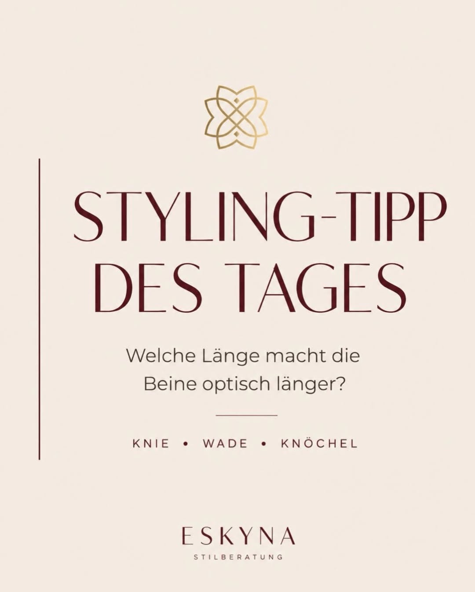
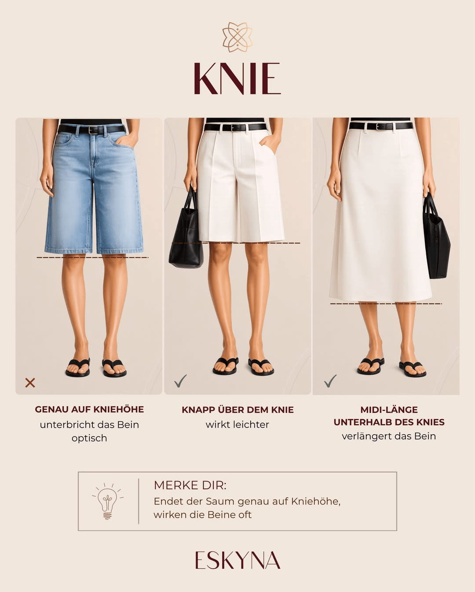
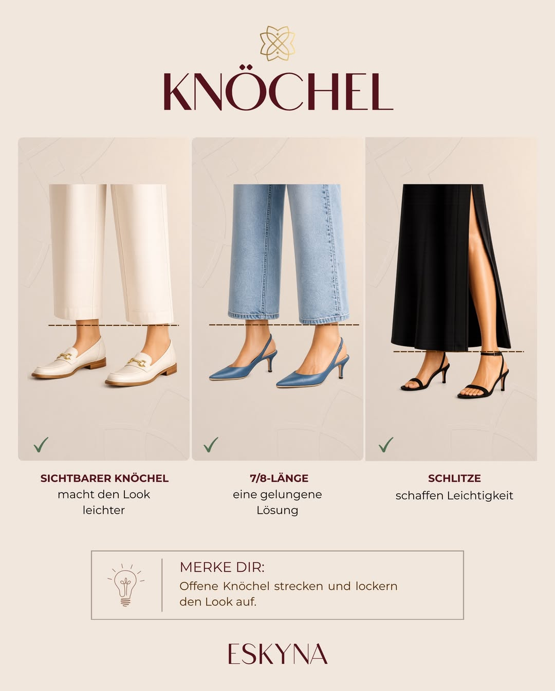

Длина одежды кажется мелочью.

Но именно она часто первой меняет впечатление от образа.

Юбка может быть качественной. Цвет может вам идти. Крой может быть удачным. И все же иногда возникает ощущение: что-то не так.

- Ноги выглядят короче.
- Силуэт кажется тяжелее.
- Образ теряет легкость.

Часто дело не в вашей фигуре. И не в том, что вам не идут юбки. Очень часто все решают несколько сантиметров по линии низа.

Именно поэтому стоит осознанно смотреть на длину юбки. Наш глаз воспринимает пропорции не нейтрально. Линии, визуальные разрывы и видимые узкие точки влияют на то, будет ли образ казаться вытянутым, спокойным и гармоничным или более компактным и тяжелым. Одежда также является частью социального восприятия: она влияет на то, как считывается внешний образ эстетически и социально.

## Содержание

- Почему длина юбки так сильно меняет впечатление
- Колено: самая сложная линия низа
- Икра: самая частая летняя ошибка
- Щиколотка: маленькая зона, большой эффект
- Как найти свою идеальную длину
- Вывод: проблема обычно не в фигуре, а в линии

## Почему длина юбки так сильно меняет впечатление

Длина юбки это не просто цифра. Это горизонтальная линия на вашем теле.

И именно эта линия направляет взгляд.

Если юбка заканчивается на широкой или визуально неспокойной зоне, эта зона подчеркивается. Если линия низа попадает на более узкое место, образ обычно выглядит легче и спокойнее. Принцип простой: глаз ищет опорные точки. Он считывает не отдельные элементы, а общую композицию.

Для стиля это означает следующее:

Одна и та же длина работает по-разному в зависимости от точки на ноге. Иногда несколько сантиметров полностью меняют ощущение от комплекта.

> **Важно:** Лучшая длина юбки не всегда самая модная. Обычно это та длина, при которой ваши пропорции выглядят наиболее чисто и гармонично.

## Колено: самая сложная линия низа

Колено это сложная точка для юбок и платьев.

Если низ заканчивается ровно по центру колена, нога визуально разделяется. Взгляд задерживается на этой линии. Из-за этого ноги могут казаться короче, даже если вещь хорошо сидит.

Особенно часто это происходит с прямыми юбками, бермудами или платьями с четким плотным низом.

### Что лучше работает в зоне колена

Обычно легче смотрится длина чуть выше колена. Нога воспринимается свободнее, а силуэт становится динамичнее.

Также хорошо может работать миди чуть ниже колена. Главное, чтобы низ не совпадал точно с самой выступающей линией колена.

**Часто удачно работают:**

- длина немного выше колена
- длина немного ниже колена
- миди, если низ не попадает на широкую часть икры

**Осторожнее с:**

- длиной строго по линии колена
- очень прямым жестким низом без движения
- тяжелыми тканями, которые добавляют объема

> **Запомните:** Если низ заканчивается точно на колене, нога часто выглядит визуально разрезанной. Пара сантиметров выше или ниже может заметно улучшить впечатление.

## Икра: самая частая летняя ошибка

Именно в зоне икры летом чаще всего случаются стилистические ошибки.

Многие юбки и платья заканчиваются на самой широкой части икры. На вешалке это может выглядеть нормально, а в образе часто утяжеляет силуэт.

Почему так происходит? Потому что горизонтальная линия ставится в самой объемной точке. Взгляд автоматически идет туда, и зона кажется крупнее.

### Что лучше работает в зоне икры

Старайтесь, чтобы низ заканчивался на более узком участке икры или чуть ниже самой широкой точки. Так силуэт выглядит спокойнее и визуально вытягивается.

Помогают также разрезы, мягкие струящиеся ткани и легкая А-линия.

**Часто удачно работают:**

- низ на более узкой части икры
- длина чуть ниже самой широкой точки икры
- струящиеся ткани
- легкая А-линия
- боковой или передний разрез

**Осторожнее с:**

- длиной строго на самой широкой части икры
- жесткими тканями
- тяжелыми прямыми миди-юбками
- широкими ремешками на щиколотке, если в образе уже много горизонтальных линий

> **Запомните:** Икра выглядит гармоничнее, когда линия низа не подчеркивает самую широкую часть, а попадает в более спокойную точку.

## Щиколотка: маленькая зона, большой эффект

Щиколотку в стайлинге часто недооценивают.

Но это одна из ключевых зон, если вы хотите добавить образу легкости. Когда щиколотка остается видимой, появляется визуальный воздух. Образ выглядит современнее и подвижнее.

По этой же причине длина 7/8 часто работает очень удачно.

### Что лучше работает в зоне щиколотки

Если вы носите длинные юбки, важно оставить ощущение воздуха: через открытую щиколотку, разрез, мягкую ткань или обувь, которая не укорачивает стопу.

**Часто удачно работают:**

- открытая щиколотка
- длина 7/8
- макси с разрезом
- струящаяся ткань
- открытая обувь или тонкие ремешки
- обувь с более низким верхом, где видна большая часть стопы

**Осторожнее с:**

- очень длинными тяжелыми юбками без движения
- низом, лежащим прямо на обуви
- сочетанием закрытой обуви, плотной ткани и темного цвета
- широкими ремешками на щиколотке при уже «разрезанном» силуэте

> **Запомните:** Видимая щиколотка не всегда автоматически удлиняет образ, но почти всегда убирает лишнюю тяжесть.

## Как найти свою идеальную длину

Идеальная длина находится не по таблице, а перед зеркалом.

Возьмите юбку или платье, в которых вы сомневаетесь, и попробуйте несколько вариантов. Поднимите низ до колена, затем чуть выше, затем ниже. Сдвигайте линию на несколько сантиметров.

Чаще всего достаточно разницы в два-пять сантиметров.

Проверьте три вопроса:

1. **Где задерживается взгляд?**

Если взгляд сразу упирается в линию низа, длина может быть визуально шумной. 2. **Нога выглядит разделенной или вытянутой?**

Хорошая длина ведет взгляд дальше, а не резко обрывает его. 3. **Есть ли в образе легкость?**

Летом образу нужен воздух. Узкие видимые зоны, движение ткани и мягкие линии помогают его создать.

Дополнительный лайфхак: сфотографируйте себя в зеркале. На фото пропорции часто читаются яснее.

## Обувь тоже меняет восприятие длины

Длина юбки никогда не работает отдельно от обуви.

Один и тот же миди может выглядеть легко с тонкими туфлями и заметно тяжелее с очень закрытой массивной обувью.

Простая ориентировка:

- короткие юбки часто выдерживают более объемную обувь
- миди требуют более точного выбора формы обуви
- длинные юбки смотрятся легче при видимой стопе, разрезе или движении
- ремешки на щиколотке красивы, но могут дополнительно укорачивать линию

## Чеклист для примерки

Перед покупкой задайте себе не только вопрос «нравится ли мне эта юбка», но и вопрос «где именно она заканчивается на моем теле».

Проверьте:

- заканчивается ли юбка ровно на колене
- попадает ли низ на самую широкую часть икры
- остается ли щиколотка видимой
- легкая ли ткань по ощущению
- подходит ли длина к обуви, которую вы реально носите
- удобно ли двигаться
- гармонично ли это выглядит спереди и сбоку

Если вещь почти удачная, но не совсем, небольшая корректировка длины у портного часто решает все.

## Вывод: дело не в фигуре

Если юбка выглядит негармонично, причина обычно не в вашем теле.

Чаще всего проблема в линии.

Правильная длина делает образ легче, современнее и собраннее. Она может визуально вытянуть ноги, успокоить пропорции и повысить общее качество впечатления.

> **Важно:** Не каждая длина должна визуально «делать выше». Но каждая длина должна быть выбрана осознанно.

## Какая длина подходит именно вам?

На персональной консультации по стилю вы поймете, какие длины, силуэты и пропорции лучше всего поддерживают вашу внешность и вашу задачу в жизни.

Потому что сильный образ начинается не с трендов.

Он начинается с ясности.

Instagram-пост к статье: [Стайлинг-подсказка по длине юбки](https://www.instagram.com/p/DZ4pbmUCgX9/?img_index=1).



## Источники и дополнительная литература

Для этой статьи использованы материалы о социальном восприятии и визуальной организации.

- Hester, N. und Hehman, E.: [Dress Is a Fundamental Component of Person Perception](https://pmc.ncbi.nlm.nih.gov/articles/PMC10559650/), Personality and Social Psychology Review.
