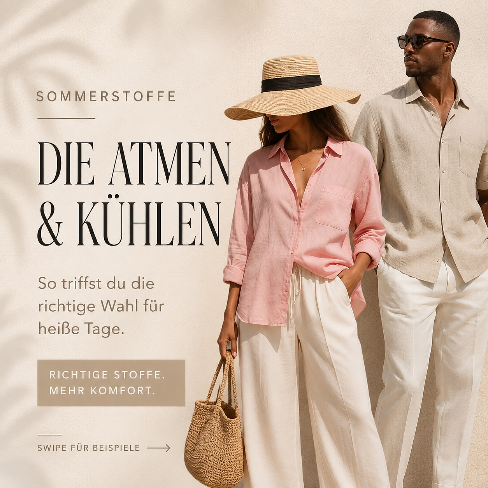
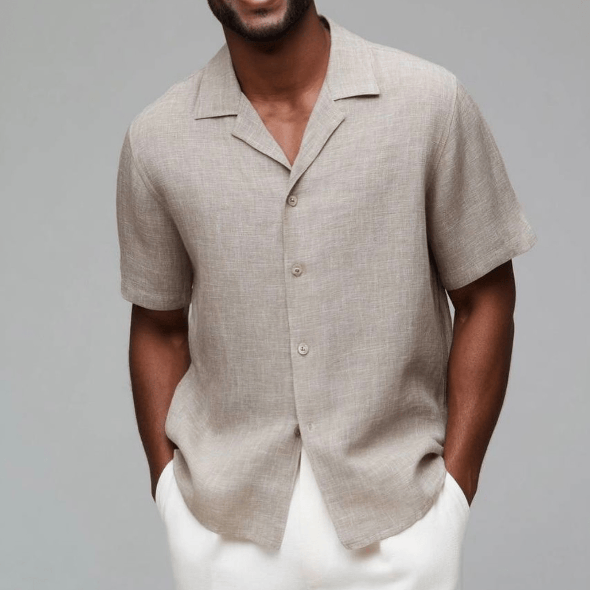

## Тизер

На улице очень жарко.

И именно сейчас решает не только цвет, но прежде всего материал.

Если в жару одежда становится некомфортной, причина часто не в крое, а в ткани. Она может липнуть, задерживать тепло или плохо пропускать воздух. Хорошая новость в том, что правильные летние ткани делают образ не только визуально легче, но и заметно приятнее в носке.

> **Важно:** В жару работает не «меньше одежды», а «правильная одежда».

_Легкие ткани, светлые оттенки и свободный крой делают летний стиль одновременно комфортным и аккуратным._

## Содержание

- Почему ткань так важна в жару
- Лучшие летние ткани: лен, хлопок, вискоза и шелк
- Какие материалы в жару стоит выбирать осознаннее
- Почему светлые цвета ощущаются комфортнее
- Стайлинг-совет: свободная посадка работает лучше
- Идеи образов из фотосерии
- Вывод: летний стиль начинается с материала

## Почему ткань так важна в жару

В жаркие дни важна не только «тонкая» одежда. Ключевое значение имеет то, как ткань работает с воздухом, влагой и теплом.

Комфортная летняя ткань обычно делает три вещи:

- пропускает воздух к коже
- впитывает или отводит влагу
- не ощущается тяжелой, жесткой или липкой

Официальные рекомендации по профилактике перегрева также советуют легкую, свободную, дышащую одежду и более светлые цвета. Поэтому одни комплекты в жару ощущаются легче уже с первых минут, а другие быстро становятся утомительными.

_Разница в материале. Одни ткани лучше пропускают воздух и влагу, другие быстрее накапливают тепло._

## Лучшие летние ткани для жаркой погоды

### 1. Лен: воздушно, натурально, элегантно

Лен это классика лета, и не случайно. Волокно льна более структурное, поэтому ткань часто не прилипает плотно к коже. Этот небольшой зазор помогает воздуху циркулировать.

Лен хорошо работает с влагой и нередко ощущается прохладнее. Utah State University Extension также отмечает охлаждающий эффект льняного волокна за счет влагопоглощения.

Лен особенно хорошо смотрится в:

- рубашках и блузах
- широких брюках
- расслабленных комплектах
- летних платьях
- мужских рубашках
- светлых натуральных оттенках: крем, песок, беж, молочный

Лен мнется. Но в этом и есть его летняя эстетика: одежда выглядит живой, а не «застывшей».

_Монохромные летние образы выглядят особенно дорого, когда осознанно сочетаются ткань, цвет и аксессуары._

### 2. Хлопок: просто, комфортно, универсально

Хлопок остается одним из лучших повседневных вариантов. Он приятен к коже, практичен и легко комбинируется. Важно учитывать плотность и тип ткани.

Легкие хлопковые варианты, например поплин, вуаль, батист, муслин или сирсакер, значительно комфортнее плотного денима или тяжелого джерси.

В жаркие дни особенно хорошо работают:

- белые хлопковые блузы
- платья-рубашки
- легкие футболки
- свободные хлопковые брюки
- хлопковые юбки
- тонкие рубашки

Стайлинг-совет: хлопок может выглядеть слишком casual. Ремень, украшения, очки или качественная сумка сразу добавляют структуру.

_Белая легкая блуза дает свежесть, а темные аксессуары добавляют образу контур._

### 3. Вискоза: мягко, текуче, элегантно

Вискоза отлично подходит, если вам нравятся мягкие, пластичные силуэты. Она красиво драпируется, выглядит менее жесткой, чем хлопок, и часто приятно ощущается на коже.

Rayon/вискоза обычно описываются как ткани с хорошим влагопоглощением и воздухопроницаемостью, поэтому они удобны для платьев, блуз, широких брюк и летних комплектов.

Важно смотреть на качество: очень тонкая вискоза может быстро мяться и быть более требовательной в уходе.

Хорошо подходит для:

- макси-платьев
- мягко ниспадающих блуз
- палаццо
- платьев на запах
- женственных летних образов
- легких офисных комплектов

### 4. Шелк: благородно, легко, но требовательно

Шелк летом выглядит дорого и легко. Он может приятно регулировать ощущение температуры, но требует аккуратности: пот, дезодорант и активное солнце иногда оставляют следы.

Поэтому шелк особенно уместен для ситуаций, где нет длительного пребывания под палящим солнцем: ужин, мероприятие, летний вечер, свадьба, городской элегантный выход.

Лучше выбирать свободную посадку и более светлые или принтованные варианты, если вас волнует видимость следов влаги.

## Какие материалы в жару могут быть сложнее

Не вся синтетика плохая. Технические спортивные ткани могут быть специально разработаны для отвода влаги. Но в повседневной одежде многие изделия из полиэстера, акрила или нейлона в жару быстрее ощущаются теплыми и «душными», особенно при плотной посадке.

Чаще всего сложнее переносятся:

- блузы из полиэстера без воздушности
- акриловый трикотаж летом
- тесная нейлоновая одежда
- синтетический сатин
- плотные смесовые ткани без достаточной воздухопроницаемости

Важный нюанс: сатин это тип переплетения, а не волокно. Шелковый сатин и полиэстеровый сатин ощущаются принципиально по-разному.

## Цвет тоже влияет на комфорт

Светлые оттенки лучше отражают солнечный свет, чем темные, и часто ощущаются прохладнее при прямом солнце. Cal/OSHA также рекомендует более светлую одежду в жару.

Практичные летние оттенки:

- белый
- кремовый
- экрю
- песочный
- бежевый
- светло-голубой
- розе
- шалфейный
- светлые пастельные тона

Это не значит, что черный летом под запретом. Но если вы быстро перегреваетесь, светлая палитра вместе с дышащими тканями заметно повышает комфорт.

_Светлый цвет, А-силуэт и пространство между тканью и кожей делают образ заметно более комфортным._

## Стайлинг-совет: свободная посадка работает лучше

В жару одежде нужен воздух. Слишком плотная посадка ограничивает циркуляцию и быстрее накапливает влагу. Свободный крой обычно ощущается легче.

Это не значит, что все должно быть oversize. Важнее осознанная свобода:

- широкие брюки с более компактным верхом
- свободная блуза с обозначенной талией
- расстегнутая рубашка поверх топа
- платье А-силуэта вместо тесного футляра
- легкая мужская рубашка вместо облегающей футболки

_Летняя мужская элегантность: светлая льняная рубашка выглядит спокойно, ухоженно и уместно в жару._

## Идеи образов из фотосерии

### Образ 1: Розовый льняной комплект с натуральными аксессуарами

Мягкий, летний и женственный образ без излишней «сладости». Свободный крой дает воздух, а золотые акценты и плетеная сумка добавляют структуру.

**Формула:**

Легкая ткань + тон-в-тон + натуральные аксессуары = спокойная летняя элегантность.

### Образ 2: Белая блуза с графичным рисунком

Белая база дает свежесть, рисунок оживляет образ, а темные аксессуары добавляют четкость и городской характер.

**Формула:**

Светлая база + графичный рисунок + структурные аксессуары = современный летний chic.

### Образ 3: Белое платье А-силуэта

Минималистичный образ, который не выглядит скучно: свободная форма дает движение и воздух, а аксессуары сохраняют собранность.

**Формула:**

Чистый цвет + воздушный силуэт + лаконичные детали = легкий и цельный летний образ.

### Образ 4: Светлая мужская рубашка с белыми брюками

Простой и сильный летний комплект: структурная рубашка выглядит аккуратнее, чем футболка, но сохраняет расслабленность.

**Формула:**

Льняная рубашка + светлые брюки + свободная посадка = спокойно, современно, уверенно.

## Короткий чеклист для жарких дней

Перед тем как собирать образ, проверьте:

1. Ткань легкая и дышащая?
2. Посадка достаточно свободная?
3. Оттенок скорее светлый и отражающий?
4. Есть пространство для циркуляции воздуха?
5. Ткань остается комфортной через несколько часов?
6. Образ подходит вашему реальному дню, а не только погоде?

Если на большинство вопросов ответ «да», вы, вероятно, выбрали удачный комплект для жары.

## Вывод: летний стиль начинается с материала

В жару задача не «надеть меньше», а «выбрать грамотнее».

Лен, хлопок, вискоза и легкий шелк часто дают больше комфорта за счет воздуха, работы с влагой и мягкого контакта с кожей. Светлые оттенки лучше отражают солнце, а свободный крой помогает телу легче переносить жару.

Сильный летний образ должен быть не только красивым, но и функциональным.

**Главное правило жары:**

Не меньше одежды. А правильная одежда.

## Хотите понять, какие летние ткани подходят именно вам?

На персональной консультации по стилю и цвету вы определите, какие ткани, оттенки и силуэты лучше поддерживают вашу внешность и ваш ритм жизни.

Instagram-пост к статье: [Летние ткани в Instagram](https://www.instagram.com/p/DaF9IvWCnMK/?img_index=1).



## Источники и дополнительная литература

- Cal/OSHA: рекомендации по легкой, свободной, дышащей и светлой одежде при жаре. [Источник](https://www.dir.ca.gov/dosh/etools/08-006/EWP_workClothing.htm)
- Utah State University Extension: выбор тканей для летней жары, включая лен и rayon/вискозу. [Источник](https://extension.usu.edu/news_sections/home_family_and_food/summer-hydration.pdf)
- Utah State University Extension: лен и охлаждающий эффект за счет поглощения влаги. [Источник](https://extension.usu.edu/archive/the-facts-on-flax)
- Fibre2Fashion: свойства хлопка, включая воздухопроницаемость и влагопоглощение. [Источник](https://www.fibre2fashion.com/market-intelligence/texpro-textile-and-apparel/textile-guide/10501/cotton-fabric)
- Ohio State University Fact Sheet (архив): свойства rayon/вискозы. [Источник](https://www.apparelsearch.com/education/ohio_state_clothing_education/rayon_multi-faceted_fiber.htm)
- Fibre2Fashion: свойства и позиционирование шелка. [Источник](https://www.fibre2fashion.com/market-intelligence/texpro-textile-and-apparel/textile-guide/10502/silk-fabric)
