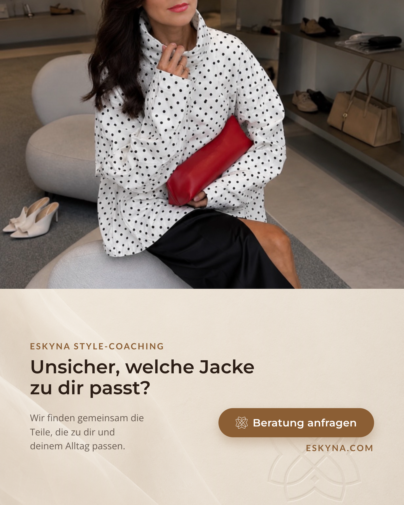

Смена сезонов каждый год приносит один и тот же стильный вызов: погода непредсказуема. Утром прохладно, днем тепло, вечером снова ветрено.

Именно поэтому демисезонная куртка становится ключевой вещью.

Если хотите глубже разобраться в теме, посмотрите глоссарий: [Layering](/ru/glossar/layering/), [Anorak](/ru/glossar/anorak/) и [Parka](/ru/glossar/parka/).

Но какой должна быть модель, чтобы она не только работала в быту, но и поддерживала ваш личный стиль? Ниже собраны главные пункты, на которые стоит опираться при выборе.

## 01. Посадка: достаточно места для многослойности

Для повседневной жизни лучше всего подходят прямые или свободные силуэты. Причина проста: многослойность.

Факт: две или три тонкие вещи часто согревают лучше, чем один очень толстый слой. Воздух между слоями работает как дополнительная изоляция. Под свободную куртку обычно удобно надеть футболку, рубашку и в более прохладные дни легкий свитер или кардиган.

Совет по стилю: короткие и более «коробочные» куртки особенно хорошо сочетаются с брюками и юбками с высокой талией. Обязательно проверьте подвижность в примерочной: поднимите руки и убедитесь, что куртка не задирается.

## 02. Воротник: защита и четкая линия

Зона шеи и затылка особенно чувствительна к ветру в переходный сезон. Высокий или стоячий воротник решает сразу две задачи: защищает от сквозняка и делает силуэт более собранным.

При покупке проверьте, чтобы застегнутый воротник не давил на подбородок и не раздражал кожу. В расстегнутом виде он должен выглядеть естественно и легко вписываться в образ.

## 03. Стилизация: спортивное плюс женственное

Анораки, парки и оверсайз-ветровки часто выглядят спортивно. Именно это можно превратить в стильный контраст.

Попробуйте сочетать функциональную куртку с атласной юбкой, slip dress или элегантными брюками, например culottes. В мягкую погоду добавьте лоферы, остроносые балетки или минималистичные сандалии.

Контраст между более утилитарной верхней одеждой и женственными элементами делает образ актуальным и выразительным.

## 04. Материал: функция прежде всего

Материал определяет не только внешний вид, но и удобство в реальной жизни.

- Хлопок или твил: выглядят натурально и качественно, хорошо дышат. Но чистый хлопок дольше сохнет и хуже подходит для дождливых дней.
- Нейлон и технические ткани: легкие, часто отлично защищают от ветра и подходят для переменчивой погоды.
- Софтшелл и смесовые ткани: хороший выбор для активного дня, когда важны воздухопроницаемость и отвод влаги.

Смотрите не только на состав, но и на качество исполнения: аккуратные ли швы, держит ли ткань форму, не мнется ли слишком быстро.

Подробнее о визуальной пластике ткани можно прочитать в глоссарии: [Materialfall](/ru/glossar/materialfall/).

## 05. Перед покупкой: быстрый практический тест

Перед финальным решением устройте короткую проверку. Куртка должна работать в реальной жизни, а не только на вешалке.

- Примерьте в расстегнутом и застегнутом виде: силуэт должен быть удачным в обоих вариантах.
- Поднимите руки и проверьте длину рукавов: ничего не тянет в спине, запястья не открываются слишком сильно.
- Проверьте молнию и капюшон: все должно открываться и закрываться без усилий.
- Проверьте карманы: помещаются ли телефон, ключи и удобно ли ими пользоваться.

## Самый честный вопрос в конце

Для каких задач вы будете носить эту куртку в ближайшие два месяца?

Лучшая модель легко встраивается в ваш текущий гардероб. Она должна работать и с позднелетними комплектами, и с первыми более теплыми осенними образами.

Если хотите выстроить более системный гардероб, полезен материал о [Capsule Wardrobe](/ru/glossar/capsule-wardrobe/).

## Какая демисезонная куртка подходит вам?

На персональной консультации по стилю мы определим, какие демисезонные куртки действительно подходят вашей фигуре, цветотипу и индивидуальности. Так вы носите функциональные образы не случайно, а осознанно.



Пост в Instagram по теме статьи: [Гид по демисезонной куртке в Instagram](https://www.instagram.com/p/DbII7pBClVP/?img_index=1).

## Источники и модные ориентиры

- Grazia: идеи многослойности для переходной погоды и сочетания спортивной куртки с женственными элементами.
- Peek and Cloppenburg: базовые рекомендации по посадке и многослойным комбинациям.
- Текстильные и outdoor-обзоры: свойства хлопка, нейлона и смесовых тканей при переменчивой погоде.
